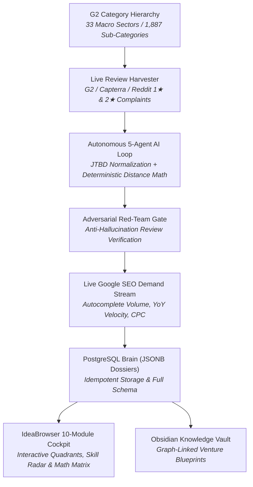

# 🚀 G2 Micro-SaaS AI Brain & Idea Engine

> **Autonomous G2 Negative Review Mining, 5-Agent AI Competitor Clustering, IdeaBrowser-Grade 10-Module Venture Dossiers & Real-Time Google SEO Disruption Command Center.**

---

## 🌟 Overview

**G2 Micro-SaaS AI Brain** is an autonomous intelligence pipeline and interactive web command center designed to discover, validate, and blueprint high-conviction B2B Micro-SaaS opportunities by mining dissatisfied incumbent users across **1,887 pure software categories** and **33 macro root sectors**.

It combines:
1. **Autonomous Voice-of-Customer Harvesting**: Continuous ingestion of 1★, 2★, and 3★ verified reviews from G2, Capterra, and Reddit.
2. **Autonomous 5-Agent Collaborative Loop & Math Matrix**: Five specialized AI agents grounded by deterministic linear algebra to normalize capabilities into Jobs-to-be-Done (JTBD), dynamically tune mathematical similarity weights, formulate competitor archetypes, adversarial red-team audit blind spots, and architect venture blueprints.
3. **IdeaBrowser-Grade 10-Module Venture Dossiers**: Full editorial blueprints containing ground-truth workplace scenes, 4 interactive quadrant telemetry cards, adversarial build/kill verdicts, 5-bar founder skill radars, 4-step value ladders, and napkin unit economics.
4. **Empirical Google SEO Demand Validation**: Real-time Google Autocomplete API queries, 12-month Google Trends indexing, and review corpus n-gram frequency extraction.



---

## ✨ Key Capabilities & Modules

### 1. 🚀 IdeaBrowser 10-Module Venture Dossiers
Every synthesized white space opportunity is formulated into an operator-grade, 10-module venture dossier:
- **Module 1: Header & Viability Badge**: High-conviction product hook + composite Opportunity Score Index (OSI).
- **Module 2: Split-Hero Metadata & Ground-Truth Scene**: 4 metadata pills (*The Customer, Market Type, Revenue Ceiling, Top Competition*) + visceral workplace scene of an employee battling manual workarounds.
- **Module 3: 4 Interactive Telemetry Quadrants**: Deep slideout sheets for *Demand Volume, Pain Severity (8.9/10), Timing Collision Window, and Year 1 Financials*.
- **Module 4: The Whitespace Crack**: Two-halves market split, 1-click unbundling wedge, startup graveyard postmortem (why previous attempts died), and beating the $0 free alternative.
- **Module 5: Verbatim Receipts & Gathering Hubs**: 3 direct customer quotes with star ratings and role citations + exact subreddits and forums where buyers congregate.
- **Module 6: Adversarial Verdict**: 4 concrete **Reasons to Build (Bull Case)** vs 4 cynical **Reasons Not to Build (Bear Case)** + practical pivot escape hatch.
- **Module 7: Founder Fit & Skill Radar**: Who it's best for vs avoid, portrait of the winning operator, 5 animated skill demand bars (*Distribution, Domain Depth, Operations, Capital, Coding*), reality metrics, and 3 early death traps.
- **Module 8: 4-Step Value Ladder**: Free Lead Magnet $\rightarrow$ Frontend SKU ($29/mo) $\rightarrow$ Core Upsell ($79-$99/mo) $\rightarrow$ Continuity / Agency Tier ($149-$199/mo).
- **Module 9: Napkin Money Math**: Month-3 pilot unit economics breakdown (72% net cash flow) and Scale Ceiling ARR model ($748,800 ARR @ 88% net margin).
- **Module 10: Action Bar & Export**: 1-click `📋 Copy Full Markdown Dossier` for Obsidian/Notion + raw citation viewer.

---

### 2. 🧠 Autonomous 5-Agent Collaborative AI Loop & Math Matrix
Anchored by deterministic Python linear algebra to prevent LLM hallucinations:
1. **Agent 1: Semantic Normalizer (`semantic_normalizer_agent.py`)**: Standardizes disparate marketing jargon into canonical Jobs-to-be-Done (JTBD) capabilities and product philosophies (e.g. Queue vs Bot vs Kanban).
2. **Agent 2: Category Weight Strategist (`category_strategist_agent.py`)**: Dynamically tunes formula weights ($W_{cap}, W_{phil}, W_{tier}, W_{gsearch}, W_{churn}$) based on domain characteristics.
3. **Deterministic Math Engine**: Computes pairwise Jaccard, philosophy, and Google consideration graph similarity matrices in pure Python.
4. **Agent 3: Strategic Cluster Formulator (`cluster_formulator_agent.py`)**: Groups products into competitor archetypes with plain-English mental models, analogies, and workflows.
5. **Agent 4: Red-Team Adversarial Auditor (`red_team_auditor_agent.py`)**: Acts as a hostile investor, verifying raw review citations to reject hallucinated gaps.
6. **Agent 5: Venture Architect (`venture_architect_agent.py`)**: Formulates full 10-module IdeaBrowser venture blueprints and validates live Google SEO demand.

---

### 3. 📊 Real-Time Google SEO Demand & Keyword Arbitrage
- Queries `suggestqueries.google.com` in real time to extract live autocomplete suggestions.
- Fetches 12-month search interest trajectories via Google Trends.
- Mines PostgreSQL review corpus n-grams to uncover organic customer search vocabulary.
- Classifies queries into *Commercial Switch, Pricing Arbitrage, Unbundling Search, and Churn Dissatisfaction*.

---

### 4. 🕸️ Interactive 2D Force-Directed Pain & Omission Graph
- Live HTML5 Canvas 2D force simulation (Coulomb repulsion, Hooke spring tension).
- Visualizes competitor clusters, shared pain bridges, cluster-isolated complaints, and **100% unresolved systemic omissions**.
- Full interactive controls: node dragging, wheel zoom, search highlight, and slideout inspection drawer.

---

## 🛠️ Tech Stack

- **Backend**: Python 3.11, FastAPI, Uvicorn, psycopg2, httpx.
- **Database**: PostgreSQL 15+ / Supabase with JSONB storage.
- **AI / LLM**: Google Gemini 3.6 Flash & Gemini 3 Flash Preview (`google-genai` SDK) with multi-model fallback resilience.
- **Frontend**: Vanilla HTML5, Vanilla CSS3 (Glassmorphism dark theme, Outfit & Plus Jakarta Sans typography), Vanilla JS Canvas physics.
- **Knowledge Base**: Obsidian Vault Markdown generator with bidirectional wikilinks.

---

## 🚀 Quick Start

### 1. Clone the Repository
```bash
git clone https://github.com/Amrith-ops/idea-generating-engine.git
cd idea-generating-engine
```

### 2. Configure Environment
Create `pipeline/.env`:
```env
GEMINI_API_KEY="your-gemini-api-key"
DB_HOST="localhost"
DB_PORT="55322"
DB_USER="postgres"
DB_PASSWORD="postgres"
DB_NAME="postgres"
```

### 3. Initialize Database Schema
```bash
python -c "from pipeline.db_client import DatabaseClient; db=DatabaseClient(); db.init_schema()"
```

### 4. Run the Dashboard
```bash
python -m uvicorn dashboard.app:app --host 0.0.0.0 --port 8000 --reload
```
Open **`http://localhost:8000`** in your browser.

---

## 📁 Repository Structure

```
├── dashboard/                      # FastAPI Backend & Frontend Cockpit
│   ├── app.py                      # REST API & NDJSON Streaming Endpoints
│   └── static/                     # Dark Glassmorphic Web Application
│       ├── index.html              # 5-Pillar Decision Cockpit & Modals
│       ├── app.js                  # Multi-view controller, dossier renderer, Canvas physics
│       └── style.css               # Master Dark Mode CSS (Cards, Badges, Radars, Tables)
├── pipeline/                       # Autonomous Intelligence & Crawling Engine
│   ├── agents/                     # 5-AGENT COLLABORATIVE AI LOOP
│   │   ├── base_agent.py           # Multi-model fallback & JSON parsing engine
│   │   ├── semantic_normalizer_agent.py # Agent 1: JTBD capability normalizer
│   │   ├── category_strategist_agent.py # Agent 2: Dynamic formula weight tuner
│   │   ├── cluster_formulator_agent.py  # Agent 3: Competitor archetype formulator
│   │   ├── red_team_auditor_agent.py    # Agent 4: Adversarial review auditor
│   │   ├── venture_architect_agent.py   # Agent 5: 10-Module dossier architect
│   │   └── orchestrator.py         # Central pipeline coordinator & progress emitter
│   ├── live_review_harvester.py    # Dual-mode G2/Capterra/Reddit harvester
│   ├── competitor_clustering_engine.py # Multi-signal clustering engine
│   ├── whitespace_omission_analyzer.py # Cross-cluster gap extractor
│   ├── keyword_volume_analyzer.py  # Live Google Autocomplete & Trends engine
│   ├── enrich_whitespace_dossiers.py # Batch dossier enrichment pipeline
│   ├── pain_graph_builder.py       # 2D network node-link graph builder
│   ├── db_client.py                # PostgreSQL client with schema migrations & pooling
│   └── obsidian_exporter.py        # Knowledge vault exporter
├── db/                             # Schema migrations & database DDL
│   └── 01_schema.sql               # PostgreSQL tables (clusters, dossiers, reviews)
└── project_management/             # Master specifications & architecture records
    ├── ideabrowser_research_framework.md # 27-Section IdeaBrowser Research Manifesto
    ├── architecture_decisions.md   # Architecture Decision Records (ADR 001 - ADR 010)
    ├── BACKLOG.md                  # 5-Gate Validation Engine & Strategic Roadmap
    └── BUGS.md                     # Bug register & root cause analyses
```

---

## 📄 License
MIT License. Built for ambitious Micro-SaaS founders and unbundling operators.
