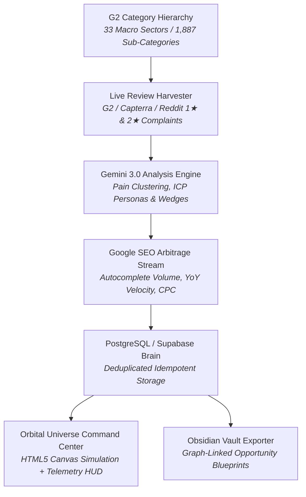

# 🚀 G2 Micro-SaaS AI Brain & Idea Engine

> **Autonomous G2 Negative Review Mining, Orbital Competitor Intelligence & Real-Time Google SEO Disruption Command Center.**

---

## 🌟 Overview

**G2 Micro-SaaS AI Brain** is an autonomous intelligence pipeline and interactive web command center designed to discover, validate, and blueprint high-conviction B2B Micro-SaaS opportunities by mining dissatisfied incumbent users across **1,887 pure software categories** and **33 macro root sectors**.



---

## ✨ Key Features

1. **🪐 Orbital Universe Visual Engine**:
   - Live HTML5 Canvas multi-tiered gravitational simulation.
   - **Orbit 0 (Sun 🔴)**: Incumbent Goliaths (e.g. Zendesk, Salesforce).
   - **Orbit 1 (Planets 🟡)**: Challengers (e.g. Gorgias, HubSpot, Zoho Desk).
   - **Orbit 2 (Moons 🟢)**: Micro-SaaS Satellites firing disruption lasers with calculated Opportunity Score Indexes (OSI).
   - **Interactive Node Collision**: Click any cosmic body or HUD item to open deep competitor intelligence or opportunity blueprints.

2. **👥 Competitor Intelligence & Complaining Personas Dossier**:
   - Deep competitor profiling: avg star ratings, pricing model traps, and market segments.
   - **Mined User Personas**: Exact buyer ICPs (e.g. *SMB Founders*, *Customer Support Leads*, *E-commerce Operators*) suffering from incumbent bloat.
   - **Verbatim Discontent Citations**: Raw 1-star and 2-star customer reviews proving unbundling demand.

3. **📊 Live Google SEO Demand & Keyword Arbitrage**:
   - Real-time search queries discovered via Google Autocomplete API + PostgreSQL review corpus n-gram mining.
   - Tracks monthly search volumes, YoY velocity growth badges, and estimated CPC.

4. **🌳 Dual-Mode AI Harvester**:
   - **🎯 Mode 1 (Sub-Category Deep Mine)**: Targeted deep dive into a specific software niche.
   - **🌳 Mode 2 (Root Sector Batch Scan)**: Autonomous batch scan across top sub-categories in any macro sector.

5. **🛡️ Idempotent Review Pipeline & Bug Prevention**:
   - Composite unique hash indexing on `(product_slug, md5(dislike_text))` to prevent duplicate review ingestion.
   - Clean data synchronization across PostgreSQL and Obsidian Markdown vaults.

---

## 🛠️ Tech Stack

- **Backend**: Python 3.11, FastAPI, Uvicorn, psycopg2.
- **Database**: PostgreSQL 15+ / Supabase (Local ports `54322` / `55322`).
- **AI / LLM**: Google Gemini 3.0 Flash (`google-genai`).
- **Frontend**: Vanilla HTML5, Vanilla CSS3 (Glassmorphism dark theme, Outfit + Plus Jakarta Sans typography), Vanilla JS Canvas physics.
- **Knowledge Base**: Obsidian Vault Markdown generator with bidirectional wikilinks.

---

## 🚀 Quick Start

### 1. Clone the Repository
```bash
git clone https://github.com/Amrith-ops/idea-generating-engine.git
cd idea-generating-engine
```

### 2. Configure Environment
Create `pipeline/.env`:
```env
GEMINI_API_KEY="your-gemini-api-key"
DB_HOST="localhost"
DB_PORT="55322"
DB_USER="postgres"
DB_PASSWORD="postgres"
DB_NAME="postgres"
```

### 3. Initialize Database Schema
```bash
python -c "from pipeline.db_client import DatabaseClient; db=DatabaseClient(); db.init_schema()"
```

### 4. Run the Dashboard
```bash
python -m uvicorn dashboard.app:app --host 0.0.0.0 --port 8000 --reload
```
Open **`http://localhost:8000`** in your browser.

---

## 📁 Repository Structure

```
├── dashboard/               # FastAPI Backend & Frontend UI
│   ├── app.py               # REST API Endpoints (/api/orbit, /api/competitor, /api/mine)
│   └── static/              # Dark Glassmorphic Dashboard
│       ├── index.html       # Single Page Cockpit & Modals
│       ├── app.js           # Canvas Physics & Dynamic Client Logic
│       └── style.css        # Master Dark Mode CSS Styles
├── pipeline/                # Autonomous Intelligence & Crawling Engine
│   ├── live_review_harvester.py   # Dual-mode G2 review harvester
│   ├── gemini_analyzer.py         # AI Unbundling & OSI scoring
│   ├── keyword_volume_analyzer.py # Google SEO Autocomplete engine
│   ├── db_client.py               # PostgreSQL client with deduplication
│   └── obsidian_exporter.py       # Knowledge vault exporter
├── db/                      # Schema migrations & database initialization
│   └── 01_schema.sql        # PostgreSQL DDL
└── project_management/      # Project documentation, roadmap & bug tracking
    ├── BACKLOG.md           # 5-Gate Validation Engine & Strategic Roadmap
    └── BUGS.md              # Bug register & root cause analyses
```

---

## 📄 License
MIT License. Built for ambitious Micro-SaaS founders and unbundling operators.
