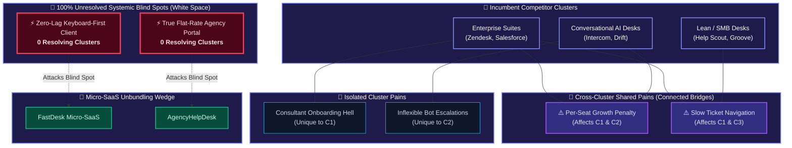

# 🕸️ Implementation Plan: Cross-Cluster Pain Network & Unresolved Omission Graph Tab

Add a dedicated interactive visualization tab to the Command Center dashboard that visually demonstrates how competitor clusters connect through shared pain points, alongside pulsating beacon nodes for **systemic pain points left unresolved by all clusters (White Space Omissions)**.

---

## 1. Architecture & Visual Concept

---

## 2. Key Components to Build

### A. Graph Data API (`GET /api/cluster-pain-graph`)
In [`dashboard/app.py`](file:///c:/ideas_brain/dashboard/app.py):
- Build a dedicated graph synthesizer that loads:
  1. `competitor_clusters` (Cluster hubs, product members, target tier).
  2. `pain_clusters` and raw `g2_reviews` linked to products/clusters.
  3. `whitespace_opportunities` (Systemic omissions, attacked clusters, target ICP, wedge).
- Produces a structured graph payload:
  - `nodes`:
    - `type: "cluster"` (id, label, tier, products_count, color)
    - `type: "pain_shared"` (id, label, dimension, severity, connected_clusters: [C1, C2], review_quotes)
    - `type: "pain_isolated"` (id, label, dimension, severity, cluster_id)
    - `type: "unresolved_omission"` (id, label, summary, solved_by_cluster_count: 0, opportunity_slug, wedge, icp, search_demand)
    - `type: "micro_saas_solution"` (id, label, osi_score, pricing, target_omission)
  - `edges`:
    - Cluster $\leftrightarrow$ Pain connections (weighted by review count and severity).
    - Pain $\leftrightarrow$ Pain similarity bridges.
    - Unresolved Omission $\leftrightarrow$ Micro-SaaS Solution attack vectors.
  - `summary_metrics`:
    - Total Pain Points, Cross-Cluster Shared Count, Systemic Omissions Count (0 Cluster Solutions), Category Resolution Index.

---

### B. Interactive Graph Visualization Engine
In [`dashboard/static/app.js`](file:///c:/ideas_brain/dashboard/static/app.js) and [`dashboard/static/index.html`](file:///c:/ideas_brain/dashboard/static/index.html):
- **New Tab in Navigation Bar**:
  - `🕸️ Pain Network & Omission Matrix` (`#tab-btn-paingraph`).
- **Interactive Visual Canvas / SVG Network View**:
  - **Dynamic Multi-Body Physics**: Nodes attract/repel naturally, with cluster anchors forming orbital gravity centers and shared pain points suspended between them.
  - **Glowing Bezier Curves / Multi-Color Chords**: Visual links connecting shared pain points to their parent clusters with particle pulses.
  - **Beacon Visual FX for Unresolved Blind Spots**: Pulsating glowing red/gold rings for pain points with **0 resolving clusters**, visually demonstrating the vacuum in the market.
  - **Interactive Drag, Pan & Zoom**: Smooth mouse wheel zooming, canvas panning, and node dragging.
  - **Filter Control Bar**:
    - 🌟 **All Nodes & Connections**
    - 🔗 **Cross-Cluster Contagion Only** (Shared pains affecting 2+ clusters)
    - 🚨 **100% Unresolved Blind Spots (White Space Omissions)**
    - 🏢 **Filter by Cluster** (Isolate Enterprise vs Conversational vs SMB)
    - 🔍 **Search Pain Keywords** (Instant highlight)

---

### C. Deep-Dive Node Inspector Drawer
- Clicking any node opens an inspector panel on the right:
  - **For Clusters**: Theme, market segment, products included, cluster pain profile, and unresolved vulnerabilities.
  - **For Shared Pain Points**: Multi-cluster contagion map, severity score, customer review verbatim quotes, and affected customer roles.
  - **For Unresolved Blind Spots (White Space)**: Comprehensive Micro-SaaS Dossier — why incumbents ignore it, target ICP, proposed flat-rate pricing, core MVP features, and live Google search demand validation.

---

### D. Styling & Glassmorphic Design System
In [`dashboard/static/style.css`](file:///c:/ideas_brain/dashboard/static/style.css):
- Premium dark-mode glassmorphic aesthetics matching the existing Universe command center.
- Neon glow tokens: Purple (`--purple-glow`), Cyan (`--cyan-glow`), Emerald (`--emerald-glow`), Rose/Ruby (`--rose-glow`), Amber (`--amber-glow`).
- Responsive layout with toolbar, canvas, mini-map, legend, and inspector drawer.

---

## 3. Proposed Changes Summary

| Component | File | Action |
| :--- | :--- | :--- |
| **Backend API** | [`dashboard/app.py`](file:///c:/ideas_brain/dashboard/app.py) | **[MODIFY]** Add `GET /api/cluster-pain-graph` with graph synthesis logic |
| **UI Structure** | [`dashboard/static/index.html`](file:///c:/ideas_brain/dashboard/static/index.html) | **[MODIFY]** Add navigation tab button, graph container, filter toolbar, legend, and inspector drawer |
| **UI Logic & Physics** | [`dashboard/static/app.js`](file:///c:/ideas_brain/dashboard/static/app.js) | **[MODIFY]** Implement graph renderer, physics simulation, node interaction, filter toggles, and inspector |
| **Design & FX** | [`dashboard/static/style.css`](file:///c:/ideas_brain/dashboard/static/style.css) | **[MODIFY]** Add CSS rules for canvas, node tooltips, filter pills, pulsating beacons, and inspector drawer |

---

## 4. Verification Plan

### Automated / Endpoint Testing
- Test `GET /api/cluster-pain-graph?category_slug=help-desk` and `GET /api/cluster-pain-graph?category_slug=crm-software`.
- Verify response format: nodes array, edges array, correct classification of `pain_shared`, `pain_isolated`, `unresolved_omission`, and `micro_saas_solution`.

### Manual & Interactive Verification
- Switch between main tabs (`Orbital Universe`, `Opportunity Grid`, `Search Volume`, `Competitor Clusters`, `Pain Network & Omission Matrix`).
- Verify node dragging, panning, zooming, and smooth link curves.
- Test all filter buttons (`All`, `Cross-Cluster Shared`, `Unresolved Blind Spots`).
- Click nodes to verify that the Inspector Drawer displays correct review quotes and Micro-SaaS wedge solutions.
