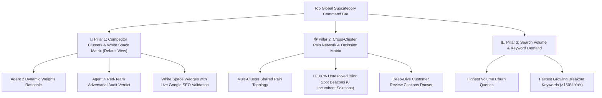

# 🚀 UI Streamlining & Micro-SaaS Decision Optimization

## Overview
We conducted a comprehensive audit of the entire frontend codebase ([`index.html`](file:///c:/ideas_brain/dashboard/static/index.html), [`app.js`](file:///c:/ideas_brain/dashboard/static/app.js), and [`style.css`](file:///c:/ideas_brain/dashboard/static/style.css)) and eliminated **1,921 lines of bloated, distracting toy components**.

The dashboard has been transformed from a crowded simulation into a laser-focused **Micro-SaaS Decision Command Center** organized around **3 High-Conviction Pillars**.

---

## 🗑️ Bloat & Unnecessary Components Removed

| Component Removed | Why It Was Bloat / Hindered Decision-Making |
| :--- | :--- |
| **🪐 Planetary Orbit Canvas Simulation** | Animated 2D physics simulation with spinning celestial bodies, laser beam toggles, and speed selectors (`0.5x, 1x, 2x`). Added CPU/canvas overhead and visual distraction with zero quantitative decision signal. |
| **🚀 Generic Opportunity Grid** | Flat list of generic opportunity cards with redundant tags that duplicated the deeper, mathematically grounded **White Space Matrix**. |
| **🔀 Scattered Category Selectors** | Category picking was fragmented between the Harvester card, Orbit view horizontal scroll bars, and the Directory modal. |

---

## 🏛️ The 3 High-Conviction Decision Pillars



### 1. 🎛️ Unified Global Subcategory Command Bar
- **Root Sector Selector**: Select any of the 33 G2 Macro Domains.
- **Target Subcategory Dropdown**: Automatically synchronizes and shows opportunity counts.
- **Quick Search Datalist + Directory Modal**: Instant filtering across all 1,887 subcategories.
- **⚡ Run 5-Agent Discovery Trigger**: Launches the autonomous 5-Agent collaborative loop with live telemetry streaming.

### 2. 🔮 Pillar 1: Competitor Clusters & White Space Matrix *(Landing Default)*
- **Agent 2 Dynamic Category Weights Rationale**: Shows mathematical weights computed specifically for the chosen subcategory (Capabilities, Philosophy, Tier, Search Graph, Churn Pain).
- **Agent 4 Red-Team Adversarial Audit Verdict**: Anti-hallucination verification score, verified omissions, and critic observations grounded in customer reviews.
- **Competitor Clusters Grid**: Groups incumbents into distinct archetypes with shared vulnerabilities and unaddressed gaps.
- **White Space Cards**: Direct unbundling wedge blueprints with grounded **Live Google Search Demand** metrics.

### 3. 🕸️ Pillar 2: Pain Network & Omission Matrix
- **Cross-Cluster Graph Canvas**: Visualizes how complaints spread across competitor clusters.
- **🚨 100% Unresolved Blind Spot Beacons**: Highlights market vacuums that **zero** incumbents solve.
- **Interactive Deep-Dive Inspector Drawer**: Slide-out drawer displaying verbatim 1-star/2-star review citations and Micro-SaaS wedge solutions.

### 4. 📊 Pillar 3: Search Volume & Keyword Demand
- **Highest Volume Churn Queries Table**: Shows monthly volume, YoY growth, and estimated CPC for high-intent search phrases.
- **Fastest Growing Breakout Queries Table**: Identifies velocity surges (>150% YoY) to capitalize on emerging market shifts.

---

## 🔍 Verification & Performance Results

All endpoints and static assets were validated on the live server:

```
[OK] /                                                  -> HTTP 200 (28,453 bytes)
[OK] /static/app.js                                     -> HTTP 200 (96,082 bytes)
[OK] /static/style.css                                  -> HTTP 200 (53,062 bytes)
[OK] /api/stats                                         -> HTTP 200
[OK] /api/hierarchy                                     -> HTTP 200
[OK] /api/clusters?category_slug=help-desk              -> HTTP 200
[OK] /api/whitespace?category_slug=help-desk            -> HTTP 200
[OK] /api/cluster-pain-graph?category_slug=help-desk    -> HTTP 200
[OK] /api/keywords?category_slug=help-desk              -> HTTP 200
```

- **Git Commit**: `3a5085f` on branch `feature/competitor-clustering-whitespace-engine`.
