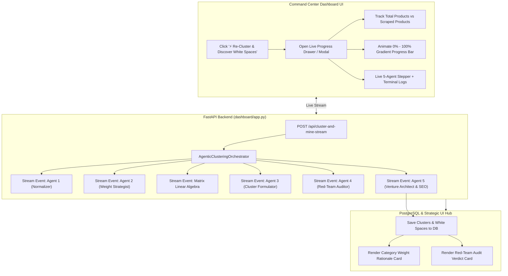

# 🚀 Implementation Plan: Wire 5-Agent AI Loop to Live Dashboard & Progress Tracker

Wire the **5-Agent Collaborative AI Loop** (`pipeline/agents/orchestrator.py`) into the FastAPI backend and Command Center UI, adding real-time progress bars, product scrape counts, live agent steppers, and exposing the **Category Weight Rationale** and **Red-Team Audit Verdict**.

---

## User Review Required

> [!IMPORTANT]
> **Live Streaming Architecture**: We will provide a real-time event streaming endpoint (`POST /api/cluster-and-mine-stream`) delivering NDJSON/SSE progress events directly to the browser. This allows the progress bar (0% $\rightarrow$ 100%), metric counters (*Total Products*, *Products Scraped/Analyzed*), and 5-agent stepper to animate in real-time with zero lag.

---

## Proposed Changes



---

### 1. Backend Orchestrator & API Updates

#### [MODIFY] [pipeline/agents/orchestrator.py](file:///C:/ideas_brain/pipeline/agents/orchestrator.py)
* Add a `progress_callback(event_dict)` parameter to `execute_agentic_clustering_and_whitespace()`.
* Track:
  * `total_category_products`: Total count of products listed in the sub-category.
  * `scraped_products_count`: Number of products scraped, features indexed, and ready for analysis.
  * `progress_pct`: Granular percentage (0% to 100%).
  * `current_agent`: Name of active agent (`SemanticNormalizerAgent`, `CategoryStrategistAgent`, `RedTeamAuditorAgent`, etc.).
  * `status_message`: Human-readable description of current task.
  * `log_entry`: Technical thought/action entry for the live terminal feed.

#### [MODIFY] [dashboard/app.py](file:///C:/ideas_brain/dashboard/app.py)
* Connect `POST /api/cluster-and-mine` to `AgenticClusteringOrchestrator`.
* Add streaming endpoint `POST /api/cluster-and-mine-stream` returning a `StreamingResponse` (NDJSON stream) so the browser can read live progress chunk by chunk.
* Update `GET /api/clusters` to include `weight_analysis` and `red_team_audit` metadata.

---

### 2. Frontend UI & Progress Visualizer

#### [MODIFY] [dashboard/static/index.html](file:///C:/ideas_brain/dashboard/static/index.html)
* Add **Live 5-Agent Execution Modal (`#agent-progress-modal`)**:
  * **Top Metrics Row**:
    * 📦 **Total Category Products**: e.g., `12 Products Discovered`
    * ⚡ **Scraped & Analyzed**: e.g., `6 / 6 Fully Profiled`
    * 🤖 **Active Agent**: e.g., `Agent 4: Red-Team Auditor`
  * **Glow Progress Bar**: Fluid animated gradient bar with percentage counter (`0%` $\rightarrow$ `100%`).
  * **7-Step Visual Agent Stepper**:
    1. 🔍 *Product Discovery & Scraping*
    2. 🧠 *Agent 1: Semantic Normalizer (JTBD Mapping)*
    3. ⚖️ *Agent 2: Weight Strategist (Domain Tuning)*
    4. 📐 *Deterministic Linear Algebra Matrix*
    5. 🏢 *Agent 3: Cluster Formulator*
    6. 🛡️ *Agent 4: Red-Team Auditor (Sceptic Gate)*
    7. 🚀 *Agent 5: Venture Architect & Live SEO Validation*
  * **Live Terminal Stream**: Scrolling terminal console showing live reasoning and citations.
* Add **Strategic Intelligence Hub** to the Clusters Section:
  * **⚖️ Category Weight Strategy Card**: Visual breakdown of tuned weights + Agent 2's strategic rationale.
  * **🛡️ Red-Team Adversarial Audit Verdict Card**: Audit status badge (`PASSED`), confidence score, and verified surviving omissions.

#### [MODIFY] [dashboard/static/app.js](file:///C:/ideas_brain/dashboard/static/app.js)
* Implement `triggerClusterAndMine()` with readable stream consumption (`response.body.getReader()`).
* Update modal progress bar, metrics, stepper checkmarks, and terminal logs in real-time.
* Render the Category Weight Rationale and Red-Team Audit Verdict cards into the Clusters view on completion.

#### [MODIFY] [dashboard/static/style.css](file:///C:/ideas_brain/dashboard/static/style.css)
* Add styling for:
  * `.agent-progress-modal` & backdrop blur.
  * `.progress-bar-container`, `.progress-bar-fill` with flowing gradient animation.
  * `.agent-stepper-grid`, `.stepper-step.active`, `.stepper-step.done`.
  * `.agent-terminal-box` (dark monospace feed).
  * `.strategy-rationale-card` & `.red-team-verdict-card`.

---

## Verification Plan

### Automated Tests
1. **API Streaming Verification**:
   ```bash
   python -c "import urllib.request, json; req = urllib.request.Request('http://localhost:8000/api/cluster-and-mine-stream', data=json.dumps({'category_slug': 'help-desk'}).encode(), headers={'Content-Type': 'application/json'}); res = urllib.request.urlopen(req); [print(line.decode().strip()) for line in res]"
   ```
   * Verify all 7 steps stream valid JSON chunks with increasing `progress_pct` (10% $\rightarrow$ 100%).
   * Verify `total_category_products` and `scraped_products_count` are populated.

2. **Integration Health Check**:
   * Verify `GET /api/clusters?category_slug=help-desk` returns clusters, weight rationale, and red-team audit observations.

### Manual / Browser Verification
1. Open `http://localhost:8000`.
2. Navigate to **🔮 Competitor Clusters & White Space** tab.
3. Click **⚡ Re-Cluster & Discover White Spaces**.
4. Confirm:
   - Progress modal pops up immediately.
   - Total products count and scraped count display accurately.
   - Progress bar smoothly animates from 0% to 100%.
   - Stepper checks off each agent in sequence.
   - Terminal logs stream agent reasoning.
   - On completion, modal closes (or shows celebration check) and renders the **Category Weight Rationale Card** and **Red-Team Audit Verdict Card**.
