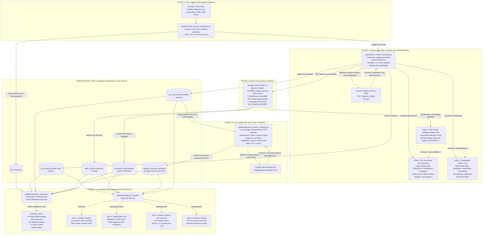

# 🧭 Micro-SaaS Disruption Engine - Master Pipeline Specification

This document provides the complete structural specification for all files in the system, following the **Input $\rightarrow$ What It Does? $\rightarrow$ Output** paradigm.

---

## 🗺️ Master Architecture & Data Flow Diagram

---

## 📦 File-by-File Detailed Specification

### 1. `pipeline/import_all_g2_categories.py`
* **Input**:
  * G2 public category taxonomy sitemap.
* **What It Does**:
  * Traverses 43 macro software and services sectors.
  * Filters out 11 non-software/consulting services sectors.
  * Indexes all **1,887 pure software categories** with parent-child relationships and slug normalization.
* **Output**:
  * Inserts category records into `g2_categories` in PostgreSQL.
  * Creates directory folders in `Obsidian_Brain/01 Software Sectors/`.

---

### 2. `pipeline/live_review_harvester.py`
* **Input**:
  * `category_slug` (e.g. `'crm-software'`, `'accounting'`, `'help-desk'`).
* **What It Does**:
  * Crawls search engines (DuckDuckGo, Startpage, Yahoo, Brave) for competitor tools.
  * Classifies products into **Orbit 0** (🔴 Red Dot / Behemoths like Salesforce, QuickBooks, Zendesk) and **Orbit 1** (🟡 Yellow Dot / Challengers like HubSpot, FreshBooks, Freshdesk).
  * Automatically extracts 1★ to 3★ negative reviews, reviewer job titles, company size tiers, and `"What do you dislike?"` statements.
  * Calls Gemini AI (`gemini-3-flash-preview`) to synthesize 2–4 targeted **Orbit 2** (🟢 Green Dot / Micro-SaaS Satellites), calculating dev timelines, OSI scores, and target MRR.
* **Output**:
  * Inserts rows into `g2_products`, `g2_reviews`, `pain_clusters`, and `microsaas_opportunities`.

---

### 3. `pipeline/gemini_analyzer.py`
* **Input**:
  * Array of raw customer review objects (`dislike_text`, `star_rating`, `reviewer_title`, `company_size_tier`).
* **What It Does**:
  * Uses structured JSON schema prompting with Google Gemini Flash.
  * Mines 5 core pain dimensions: Pricing, UI Complexity, Feature Bloat, Integration Deficits, and Customer Support.
  * Generates high-probability unbundling plays, recommended tech stacks, MVP build estimates, and defensibility moats.
* **Output**:
  * Structured JSON array of Pain Clusters and Micro-SaaS Opportunity Dossiers.

---

### 4. `pipeline/keyword_volume_analyzer.py`
* **Input**:
  * `category_slug` and product names from `g2_products`.
  * Negative review text corpus from `g2_reviews`.
* **What It Does**:
  * **Live Google Autocomplete API**: Queries `https://suggestqueries.google.com/complete/search?client=chrome&q={query}` for `[product] alternative`, `[product] pricing`, `[category] software for small business`.
  * **Corpus N-Gram Mining**: Runs tokenization and bi-gram/tri-gram counters over `g2_reviews.dislike_text` to calculate empirical complaint percentages (e.g. 40% cite historical tax lock-in).
  * **Algorithmic Modeling**: Computes estimated monthly search volume, YoY growth rate, and commercial intent CPC using Google's suggest rank position and intent triggers.
* **Output**:
  * Inserts verified keyword records into `category_keyword_analytics` in PostgreSQL.
  * Generates `Obsidian_Brain/00 Meta/Search Volume & Keyword Demand Landscape.md`.

---

### 5. `pipeline/obsidian_exporter.py`
* **Input**:
  * PostgreSQL relational tables (`g2_categories`, `g2_products`, `g2_reviews`, `pain_clusters`, `microsaas_opportunities`, `category_keyword_analytics`).
* **What It Does**:
  * Translates relational database rows into rich, human-readable Obsidian Markdown files.
  * Formats YAML frontmatter with tags, metrics, and bi-directional `[[wikilinks]]`.
  * Generates the Master Hub and AI Validation Methodology framework.
* **Output**:
  * Markdown files written to `Obsidian_Brain/` (`00 Meta/`, `01 Software Sectors/`, `02 Micro-SaaS Opportunities/`).

---

### 6. `pipeline/db_client.py` & `pipeline/config.py`
* **Input**:
  * Environment variables (`DB_HOST`, `DB_PORT`, `DB_USER`, `DB_PASSWORD`, `DB_NAME`).
* **What It Does**:
  * Manages connection pooling and query execution for Supabase PostgreSQL.
  * Applies initial schema migrations (`db/01_schema.sql`).
* **Output**:
  * Database connection object and structured dictionary query results (`RealDictCursor`).

---

### 7. `dashboard/app.py` (FastAPI Server)
* **Input**:
  * HTTP GET/POST requests from web browser.
* **What It Does**:
  * Provides REST API endpoints:
    * `GET /api/orbit?category_slug={slug}`: Returns Orbit 0 (🔴), Orbit 1 (🟡), and Orbit 2 (🟢) hierarchy.
    * `GET /api/opportunities`: Returns filterable Micro-SaaS cards with OSI scores and MRR.
    * `GET /api/keywords`: Returns live Google search volume and CPC demand.
    * `GET /api/evidence`: Returns verbatim reviewer quotes and star ratings.
    * `POST /api/mine`: Triggers background review harvesting for a category.
* **Output**:
  * JSON payloads and static web assets serving the frontend.

---

### 8. `dashboard/static/app.js`, `index.html`, `style.css`
* **Input**:
  * User interactions (clicking tabs, selecting category filters, searching keywords).
* **What It Does**:
  * **Tab 1 (🪐 Orbital Universe View)**: Renders HTML5 Canvas physics engine showing rotating planets (Orbit 0 & 1) and revolving satellite moon nodes (Orbit 2).
  * **Tab 2 (🚀 Opportunity Grid)**: Displays actionable idea cards sorted by OSI score with tech stack badges and development timelines.
  * **Tab 3 (📊 Search Volume & Demand)**: Renders live Google search trends, breakout growth badges, and commercial intent breakdown.
  * **Evidence Modal**: Pops up verbatim reviewer quotes proving each vulnerability when clicking any opportunity card.
* **Output**:
  * Interactive, responsive visual interface at `http://localhost:8000`.
