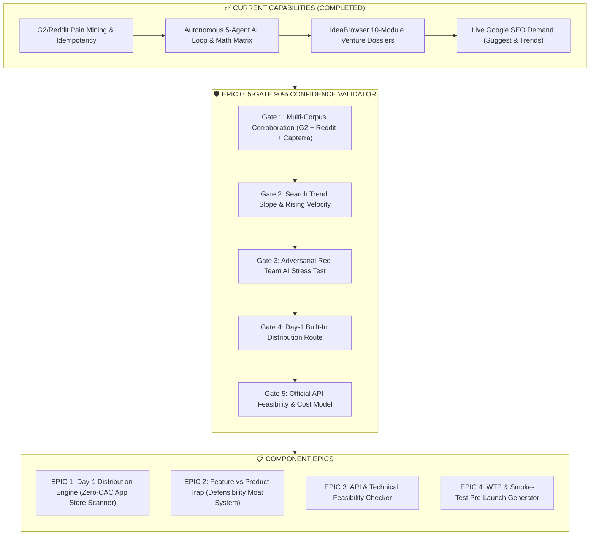
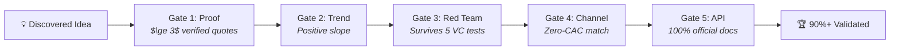

# 📋 Project Backlog & Strategic Product Roadmap

**Repository:** `ideas_brain`  
**Focus Area:** Micro-SaaS Idea Discovery $\rightarrow$ 90%+ Verified Validation & Technical Execution  
**Created:** September 2026  
**Status:** Active Backlog

---

## 🎯 Strategic Context & Objective

The **Ideas Brain Discovery Pipeline** currently automates:
1. **Taxonomy & Sector Ingestion** (1,887 pure software categories across 33 macro sectors).
2. **Negative Review Harvesting** (1★ to 3★ complaints from G2/Capterra/Reddit with idempotency hash indexing).
3. **Autonomous 5-Agent AI Loop & Math Matrix** (Semantic normalizer, category weight strategist, deterministic distance math, cluster formulator, red-team review auditor, venture architect).
4. **IdeaBrowser-Grade 10-Module Venture Dossiers** (16-key JSONB payloads, ground-truth workplace scenes, 4 interactive quadrants, adversarial verdicts, founder skill radars, value ladders, napkin money math).
5. **Live Google SEO Demand Validation** (Autocomplete stream, 12-month Google Trends trajectory, n-gram corpus mining, commercial CPC intent).

To achieve **$\ge 90\%$ deterministic confidence** and bridge the gap between **"Validated Idea Dossier"** and **"First $10,000 MRR"**, the following epics are scheduled in this backlog.

---

## 📌 Epics & Backlog Architecture

---

## 🏆 EPIC 0: The Automated 5-Gate Validation Engine ($\ge 90\%$ Trust Framework)

* **Objective**: Eliminate LLM "generative optimism" and false positives. Automatically grade every generated idea against an objective 5-Gate Rubric so founders can trust recommendations with $\ge 90\%$ certainty.

### The 5 Automated Validation Gates:

1. **Gate 1: Multi-Corpus Corroboration (Proof Verification)**:
   * **Rule**: Pain cannot rely on a single source or isolated review.
   * **Mechanism**: Cross-checks G2, Capterra, and Reddit (`r/SaaS`, `r/freelance`, `r/startups`, `r/smallbusiness`).
   * **Pass Criteria**: $\ge 3$ independent verbatim buyer quotes across $\ge 2$ different platforms.

2. **Gate 2: Search Trend Slope & Growth Velocity (Demand Verification)**:
   * **Rule**: Search interest must be accelerating, not declining legacy volume.
   * **Mechanism**: Evaluates 12-month to 3-year Google search query trajectory and Google "People Also Ask" (PAA) expansion trees.
   * **Pass Criteria**: Trajectory slope is positive with $\ge 25\%$ YoY momentum.

3. **Gate 3: Adversarial Red-Team AI Stress Test (Viability Verification)**:
   * **Rule**: The idea must withstand a hostile, cynical investor critique.
   * **Mechanism**: A dedicated Adversarial Critic Agent (`pipeline/adversarial_validator.py`) attacks the idea with 5 lethal failure tests:
     1. *The "Why hasn't the incumbent built this?" Test*.
     2. *The "Is this just a feature widget, not a business?" Test*.
     3. *The "Switching Friction & Data Migration Hell" Test*.
     4. *The "Platform Extinction / API Deprecation Risk" Test*.
     5. *The "TAM & Unit Economics" Test ($49/mo $\times$ 200 users = $10k MRR)*.
   * **Pass Criteria**: Red Team Lethality Score $< 3/10$; Rebuttal Defensibility Score $\ge 8/10$.

4. **Gate 4: Day-1 Built-In Distribution Match (Acquisition Verification)**:
   * **Rule**: No idea is approved if it requires 12 months of organic SEO or $10,000 in paid Google Ads on Day 1.
   * **Mechanism**: Matches the workflow to native app marketplaces (Shopify App Store, Chrome Web Store, Zapier Directory, HubSpot Marketplace).
   * **Pass Criteria**: At least 1 pre-existing marketplace with built-in buyer search traffic.

5. **Gate 5: Official API Feasibility & Infrastructure Cost Model (Technical Verification)**:
   * **Rule**: 100% reliance on stable, documented public endpoints.
   * **Mechanism**: Verifies REST/GraphQL API support (Stripe, QuickBooks, Xero, Zendesk, Salesforce) and estimates hosting/token costs per 1,000 active users.
   * **Pass Criteria**: No private reverse-engineering required; serverless COGS $< 15\%$ of revenue.

---

### 🚀 EPIC 1: Day-1 Distribution Engine (Zero-Dollar CAC & App Store Piggybacking)

* **Objective**: Ensure every discovered Micro-SaaS has a guaranteed acquisition channel on launch day.
* **Key Capabilities to Build**:
  1. **App Store & Marketplace Scanner**:
     * Auto-detect if the opportunity fits into:
       * **Shopify App Store** (for DTC/e-commerce unbundling)
       * **Chrome Web Store** (for browser-native overlays & sidebar extensions)
       * **Zapier / Make.com App Directory** (for integration bridges)
       * **HubSpot Marketplace / Atlassian Marketplace**
  2. **ICP Customer Discovery & Pitch Script Generator**:
     * Generate 3-step cold outreach sequences (LinkedIn & Email) personalized to the exact reviewer title and company tier identified in `g2_reviews` (e.g. *"Field Sales Reps in 10-50 person agencies"*).
  3. **Subreddit & Community Signal Matching**:
     * Identify high-intent communities (e.g. `r/SaaS`, `r/freelance`, `r/ecommerce`, Indie Hackers) actively seeking workarounds.

---

### 🛡️ EPIC 2: The "Feature vs Product Trap" (Defensibility & Moat Analyzer)

* **Objective**: Filter out simple feature widgets that can be cloned in a single sprint.
* **Key Capabilities to Build**:
  1. **Four-Pillar Moat Scoring System**:
     * **Data Moat (Stickiness)**: Mission-critical data storage (e.g. 7-year tax audit archives).
     * **Workflow Habit Moat**: Daily, high-frequency operational speed (sub-100ms keyboard-first UX).
     * **Multiplayer / Agency Moat**: Viral expansion via client portals and contractor invites.
     * **Ecosystem Bridge Moat**: Two-way sync across competing proprietary platforms (e.g. Stripe $\leftrightarrow$ Xero).
  2. **Incumbent Reaction Risk Index**:
     * Predict whether the incumbent will ignore the niche (low ACV) vs copy it.

---

### ⚙️ EPIC 3: API & Technical Feasibility Checker

* **Objective**: Eliminate technical blind spots before writing code.
* **Key Capabilities to Build**:
  1. **Ecosystem API Support Scanner**:
     * Verify official REST/GraphQL APIs and webhooks for target platforms.
  2. **OAuth & Permission Tier Checker**:
     * Identify required developer partner tiers and scopes.
  3. **Rate Limit & Cost Modeling**:
     * Estimate backend infrastructure operating costs per 1,000 active users.

---

### 💳 EPIC 4: Willingness to Pay (WTP) & Smoke-Test Landing Page Generator

* **Objective**: Validate financial commitment before writing backend code.
* **Key Capabilities to Build**:
  1. **1-Click High-Converting Pre-Launch Landing Page**:
     * Auto-generate responsive HTML/Tailwind landing pages with copy extracted from top pain complaints.
  2. **Stripe Pre-Order / Waitlist Integration**:
     * Capture pre-order deposits or verified email commitments.
  3. **Switching Friction Score**:
     * Quantify migration complexity and auto-generate 1-click import strategies.

---

## 📊 Backlog Prioritization Matrix

| Priority | Epic / Item | Strategic Impact | Dev Effort | Value Delivered |
| :---: | :--- | :---: | :---: | :--- |
| **P0** | **EPIC 0: Automated 5-Gate Validation Engine** | 🏆 Crucial | 1 Week | **Achieves $\ge 90\%$ deterministic trust in all generated ideas.** |
| **P1** | **EPIC 1: Day-1 Distribution Engine** | 🟢 Extremely High | 2 Weeks | Guarantees zero-dollar CAC and Day-1 user acquisition. |
| **P1** | **EPIC 2: Feature vs Product Moat Analyzer** | 🟢 Extremely High | 1 Week | Filters out fragile single-feature copycats. |
| **P2** | **EPIC 3: API & Technical Feasibility Checker** | 🟡 High | 1 Week | Prevents closed API dead ends. |
| **P2** | **EPIC 4: WTP & Smoke-Test Generator** | 🟡 High | 2 Weeks | Pre-sells the product before writing backend code. |

---

*Maintained in `project_management/BACKLOG.md` as part of the `ideas_brain` product roadmap.*
