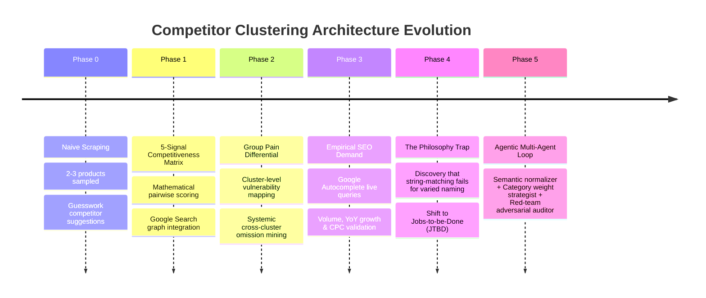

# 🏛️ Architecture Decision Records (ADR)
## Competitor Clustering, White Space Engine & Agentic AI Evolution

This document chronicles the architectural evolution, decision rationale, trade-offs, and design breakthroughs of the **Competitor Clustering & White Space Omission Engine** in the G2 Micro-SaaS Brain.

---

## 📜 Chronological Evolution Timeline



---

## ADR-001: Transition from Naive Sampling to 5-Signal Competitiveness Formulation

### Context & Problem
In the initial version, the system scraped only the top 2–3 products per category and made ungrounded heuristic guesses about which products competed against each other. There was no formal definition of SaaS competitiveness, leading to inconsistent suggestions.

### Decision
1. **Exhaustive Product Discovery**: Scrape and index all 6–12+ products within a subcategory along with functional feature sets.
2. **5-Signal Mathematical Similarity Formulation**:
   Pairwise similarity between products $A$ and $B$ is computed as:
   $$\text{Competitiveness}(A, B) = 0.25 \cdot S_{\text{feature}} + 0.20 \cdot S_{\text{taxonomy}} + 0.20 \cdot S_{\text{market\_tier}} + 0.20 \cdot S_{\text{google\_graph}} + 0.15 \cdot S_{\text{reviews}}$$

### Signal Evaluation & Pruning Decisions
* **Retained Signals**:
  * **Feature Overlap (25%)**: Functional matrix overlap.
  * **G2 Taxonomy (20%)**: Natural organizational co-presence inside the same category.
  * **Market Tier & Price Band (20%)**: Target audience (Enterprise vs Mid vs SMB) and pricing structure (per-seat vs usage).
  * **Google Search Consideration Graph (20%)**: Querying Google Suggest for `"{ProductA} vs "` and `"{ProductA} alternatives"`.
  * **Review Discontent & Persona Overlap (15%)**: Shared ICP roles and complaint dimensions.
* **Pruned Signals**:
  * *Reviewer multi-product profile scraping*: Pruned to prevent IP bans and brittle scraping dependencies.
  * *Freeform ChatGPT competitor prompting*: Pruned in favor of empirical Google search consideration graphs.

---

## ADR-002: Group Pain-Point Differential & Cross-Cluster Omission Analysis

### Context & Problem
Comparing individual tools one-on-one (e.g. *Tool A vs Tool B*) frequently resulted in trivial feature parity debates (e.g., *"Tool A has dark mode, Tool B doesn't"*), missing macroeconomic structural opportunities.

### Decision
Cluster competitors into 2–4 **Strategic Competitor Archetypes** and perform cross-group differential analysis:
1. **Cluster Vulnerabilities**: Aggregate raw negative reviews at the group level to uncover shared structural weaknesses (e.g., all Enterprise Suites suffer from multi-week onboarding and slow UI).
2. **Cross-Cluster Evaluation**: Determine if a rival cluster (e.g. *Conversational Platforms*) successfully solves the predecessor's gap.
3. **Systemic Omission Isolation (The Blind Spot)**: Identify high-severity pain points, pricing traps, or stranded audience segments that **NO cluster in the category is addressing**.

---

## ADR-003: Phase 3 Empirical Google SEO Demand Validation

### Context & Problem
Synthesizing Micro-SaaS ideas without search volume validation creates ideas that sound logical but have zero organic buyer search demand.

### Decision
Connect every synthesized white space opportunity to live Google Autocomplete endpoints (`suggestqueries.google.com`):
* Extract empirical **Monthly Search Volume**.
* Compute **YoY Growth Velocity %** (identifying breakout queries with >200% growth).
* Estimate commercial **CPC ($ USD)** to verify buyer commercial intent.

---

## ADR-004: Resolving the "Feature Naming & Philosophy" String-Matching Trap

### Context & Problem
Traditional string matching (e.g., Jaccard text overlap) completely breaks down when products solve the **same fundamental job with different product philosophies and marketing vocabularies**:
* *Help Desk*: Zendesk calls it *"Ticket Escalations"*, Front calls it *"Shared Inboxes"*, Linear calls it *"Issue Triage"*.
* *Project Management*: Jira calls it *"Sprints & Epics"*, Notion calls it *"Databases & Boards"*, Linear calls it *"Cycles & Roadmaps"*.
Naive string matching returns 0% similarity despite 95% functional overlap.

### Decision
Deprecate raw word-to-word string matching. Implement **Semantic Capability Normalization**:
* Map marketing copy into **Standardized Functional Capabilities (Jobs-to-be-Done)**.
* Explicitly tag the **Product Solving Philosophy** (e.g. *Call-Center Queue* vs *Collaborative Email* vs *Async Git-driven*).

---

## ADR-005: Multi-Agent AI Loop with Grounded Mathematical Sandbox

### Context & Problem
Single-shot LLM prompts lack self-correction, hallucinate feature availability (or miss features behind enterprise paywalls), and cannot dynamically adapt mathematical weights for diverse software categories (e.g. DevTools vs E-Commerce vs Healthcare Compliance).

### Decision
Transition the clustering and white space engine into a **5-Agent Collaborative & Adversarial Multi-Agent Loop** anchored by deterministic Python math:

```mermaid
flowchart TD
    subgraph MultiAgentLoop ["Agentic Competitor Clustering & White Space Architecture"]
        A[Raw Product Pages & Negative Reviews] --> B[Agent 1: Semantic Capability Normalizer\nTranslates Marketing to Standard JTBD Capabilities & Philosophies]
        
        B --> C[Agent 2: Category Weight Strategist\nDynamically tunes formula weights & injects niche signals]
        
        C --> D[Deterministic Matrix Engine in Python\nCalculates Pairwise Distance & Cosine/Jaccard Math]
        
        D --> E[Agent 3: Strategic Cluster Formulator\nDefines Cluster Archetypes & Group Blind Spots]
        
        E --> F[Agent 4: Red-Team Adversarial Auditor\nChallenges omissions, verifies pricing paywalls & checks recency]
        
        F -->|Disproved / Weak| E
        F -->|Verified Omission| G[Agent 5: Venture Architect & Demand Investigator\nSynthesizes Micro-SaaS + Live Google SEO Volume]
        
        G --> H[(PostgreSQL Database: competitor_clusters & whitespace_opportunities)]
    end
```



### Specialized Agent Roles:
1. **Agent 1: The Semantic Capability Normalizer (`semantic_normalizer_agent.py`)**
   * Translates disparate product marketing into unified Jobs-to-be-Done (JTBD) vectors.
2. **Agent 2: The Category Weight Strategist (`category_strategist_agent.py`)**
   * Dynamically tunes the 5-signal weights $\vec{W}$ and injects niche domain signals based on the subcategory type.
3. **Agent 3: The Strategic Cluster Formulator (`cluster_formulator_agent.py`)**
   * Evaluates the deterministic distance matrix, draws cluster boundaries, and defines strategic themes.
4. **Agent 4: The Red-Team Adversarial Auditor (`red_team_auditor_agent.py`)**
   * Acts as a sceptic. Cross-checks review citations, verifies whether competitors recently shipped fixes, and disproves weak omissions before committing.
5. **Agent 5: The Venture Architect & Demand Investigator (`venture_architect_agent.py`)**
   * Formulates the zero-bloat Micro-SaaS wedge, unlimited flat pricing, and executes live Google Autocomplete queries.

### Triple Anti-Hallucination Guardrails:
1. **Source Citation Requirement**: Every capability or vulnerability tag must link to verbatim scraped review text or pricing tier evidence.
2. **Deterministic Linear Algebra**: Agents NEVER calculate final similarity scores in free text. Python executes the mathematical distance calculations.
3. **Adversarial Gate**: The Red-Team Auditor must sign off before any opportunity is saved to PostgreSQL.

---

## ADR-006: Live Progress Telemetry, Real-time Product Counting & NDJSON Streaming

### Context & Problem
Running comprehensive multi-product scraping and a 5-Agent Collaborative AI loop takes between 15 and 45 seconds. Without real-time visual telemetry, users have no feedback on:
1. How many total products exist in the subcategory taxonomy vs how many have been scraped.
2. Which specific agent is active and what it is analyzing.
3. Whether the process is stuck or progressing.

### Decision
Implement end-to-end asynchronous streaming from Python background workers to the browser via NDJSON (`application/x-ndjson`) Streaming Responses:
1. **Live Harvester (`/api/mine-stream`)**:
   - Emits real-time counters: `total_products` in taxonomy and `scraped_products` (e.g., product 1 of N, 2 of N).
   - Streams review extraction milestones and Gemini unbundling logs.
2. **5-Agent Collaborative Loop (`/api/cluster-and-mine-stream`)**:
   - Emits a 7-step visual stepper progression: *Discovery & Scraping $\rightarrow$ Semantic Normalizer $\rightarrow$ Weight Strategist $\rightarrow$ Matrix Math $\rightarrow$ Cluster Formulator $\rightarrow$ Red-Team Auditor $\rightarrow$ Venture Architect & SEO*.
   - Streams live thought logs, formula weights, and customer review citation checks into a monospace terminal HUD.
3. **Strategic Intelligence Hub Deck**:
   - Exposes the dynamic similarity weights ($W_{cap}, W_{phil}, W_{tier}, W_{gsearch}, W_{churn}$) and domain rationale generated by Agent 2 directly in the UI.
   - Exposes the Red-Team Adversarial Audit verdict, confidence score, and verified omissions vs rejected claims generated by Agent 4.

---

## 📁 Repository Artifacts & File Structure

```text
ideas_brain/
├── project_management/
│   ├── architecture_decisions.md       <-- THIS DOCUMENT
│   ├── BACKLOG.md
│   └── BUGS.md
├── dashboard/
│   ├── app.py                          <-- FastAPI streaming endpoints (/api/cluster-and-mine-stream, /api/mine-stream)
│   └── static/
│       ├── index.html                  <-- Strategic Intelligence Hub & Live Agent Progress Modal
│       ├── app.js                      <-- NDJSON stream consumer & dynamic gauge renderer
│       └── style.css                   <-- Glassmorphic dark mode, glowing meters & terminal styles
├── pipeline/
│   ├── agents/                         <-- AGENTIC AI ENGINE FOLDER
│   │   ├── __init__.py
│   │   ├── base_agent.py
│   │   ├── semantic_normalizer_agent.py
│   │   ├── category_strategist_agent.py
│   │   ├── cluster_formulator_agent.py
│   │   ├── red_team_auditor_agent.py
│   │   ├── venture_architect_agent.py
│   │   └── orchestrator.py
│   ├── live_review_harvester.py
│   ├── competitor_clustering_engine.py
│   ├── whitespace_omission_analyzer.py
│   ├── keyword_volume_analyzer.py
│   ├── db_client.py
│   └── gemini_analyzer.py
└── db/
    └── 01_schema.sql
```

