# 🧠 The IdeaBrowser Research & Venture Presentation Standard
## Micro-SaaS Opportunity Research & Narrative Framework

**File Location:** `project_management/ideabrowser_research_framework.md`  
**Purpose:** Golden benchmark for training LLM Venture Agents (Agent 5: Venture Architect) and designing the Founder Opportunity UI Dossier.

---

## 📌 Section 1: The Raw IdeaBrowser Benchmark (Gold Standard Reference)

Below is the verbatim text extracted from IdeaBrowser (`https://www.ideabrowser.com/hub/ideas/hobby-rental-marketplace-for-curious-beginners`):

```text
The full idea.
A curious adult reads a sewing blog on Saturday, watches a DJ set on Sunday, and by Monday $500 of Amazon boxes are on the porch. One r/Hobbies commenter names it exactly: $350 sewing machine, $100 of notions, $200 of fabric, $100 of patterns, then she sold the whole stack on a resale app without ever opening the machine box. This is not one person. Hobby spending just hit a record share of US goods consumption per Bloomberg, hobby retailers added 35,000 jobs in 18 months, and the personal savings rate fell to 2.7%, a 3-year low. People want to try more hobbies with less money to waste.

The product is a $29 first-project kit that ships Friday and comes back the next Friday. One machine, one pre-cut project, all the small tools a beginner does not know to buy, a printed guide, and a prepaid return label in the box. A $39 tier adds a 45-minute Zoom with a local instructor who earns 50% and refers her in-person students. After kit #1, a $49/month swap membership ships one hobby a month with keep-or-return. Music & Arts has run this rent-to-own math in instruments for decades at 250+ stores. Nobody has packaged it for sewing, DJing, or pottery.

Start with one hobby and one city. Sewing is the tightest fit: r/SewingForBeginners has 241,900 followers, 'rent sewing machine' gets 1,600 US searches a month at $0.80 CPC, and Joann's 800-store bankruptcy in 2025 wiped out the in-person try-it option for millions. Buy 30 used Brother CS7000X machines off Facebook Marketplace, pack the kits in a garage, and ship USPS Priority. The tech is a weekend on Shopify plus a return-label API. The founder who wins here is a sewing teacher, a working DJ, or a wedding photographer with a spare bedroom, not a marketplace operator.

The first 100 customers come from Reddit and instructors, not Google. 'Hobby kit subscription' gets 0 searches. 'Gear rental marketplace' gets 0. Buyers do not think in the platform's language yet. The wedge is 60 days of daily comments on r/SewingForBeginners overwhelm threads (a recent one titled 'first day of sewing, overwhelmed and second-guessing' drew 50+ comments in a week) and 50 cold emails to independent sewing instructors in one metro. Ten instructor partners at five referrals a month each is the whole month-3 sales team. Paid Google ads on per-vertical rental keywords come in month four, after the offer converts.

The honest kill risk is unit economics. USPS Priority round-trip is $18 on a $29 kit. Cleaning and damaged parts eat another $3. Net is $8 per round-trip before founder time, and 400+ Libraries of Things now lend the same sewing machine for free in 60+ US metros. The business only works if the rent-to-own conversion or membership retention carries the margin, the way Music & Arts' rent-to-own converts to purchase credit. Below 5% conversion, the model bleeds. Lumoid raised $5.9M with a Best Buy deal and shut down in December 2017 on this exact math. YBuy died in 2012 the same way. Prove the sewing kit converts in one city before you buy a single DJ controller.

The ceiling is a solid niche vertical business, not a marketplace: think Music & Arts for the hobbies that never got their Music & Arts. A realistic year one is $60K-$120K in gross revenue on one hobby in one city with rent-to-own driving the margin. An honest annual ceiling is $2M-$4M as a multi-metro, multi-hobby operator with a Shopify storefront and instructor revenue-share network. It is not a venture outcome. It is a real business a hobby-community operator can run.
```

---

## 🧭 Section 2: The Universal Investigative Research Engine (Algorithmic Mental Model)

To avoid overfitting to any single B2C or B2B example, we must understand the **underlying investigative algorithm**. IdeaBrowser does not generate surface-level summaries; it executes a **5-Step Investigative Research Procedure** that can be applied to *any* software category, market, or vertical.

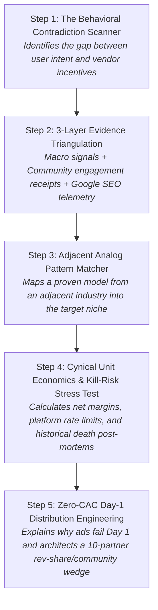

---

### 🔬 The 5 Core Investigative Algorithms

#### Algorithm 1: The "Behavioral Contradiction" Scanner
* **The Question**: *What is the user desperately trying to get done, and what perverse incentive or bloat is the incumbent forcing on them instead?*
* **Where It Looks**:
  - Places where customers are buying expensive tools, but using only 5% of the features (shelfware).
  - Workflows where users maintain messy manual spreadsheets or glue tools together with Zapier scripts just to avoid upgrading to an enterprise plan.
  - Situations where buying the tool is used as an emotional substitute for solving the problem, but users abandon it on Day 1 due to setup overwhelm.

#### Algorithm 2: The 3-Layer Evidence Triangulation
Never rely on a single data point or general sentiment. Always triangulate across 3 independent, verifiable layers:
1. **Layer 1: Macro & Industry Catalysts**: Industry pricing inflation (e.g. 14% YoY seat cost hikes), platform bankruptcies, regulatory compliance mandates, or major policy shifts.
2. **Layer 2: Community Receipts & Engagement Velocity**:
   - Community size verification (subreddits/forums with 100k+ to 250k+ members).
   - High-engagement discussion threads (threads with 30 to 500+ comments debating cost, buy-once-cry-once, or day-one overwhelm).
   - Verbatim quotes showing emotional exasperation and financial receipts.
3. **Layer 3: Google SEO Intent & Growth Velocity**:
   - Search volume ($>1\text{k - } 30\text{k+/mo}$).
   - YoY growth velocity ($>100\%\text{ to } +300\%\text{ YoY}$) to prove rising demand.
   - Commercial CPC ($>\$0.70\text{ to } \$10.00+$) proving commercial buying intent.
   - Competition index.

#### Algorithm 3: The Adjacent Analog Pattern Matcher
* **The Rule**: Never invent an untested business model from scratch.
* **The Technique**: Identify a battle-tested model that has succeeded in an adjacent industry for 10–30 years, and apply it to an unaddressed vertical.
  - *Examples*:
    - The *Music & Arts rent-to-own instrument model* $\longrightarrow$ Applied to *sewing & DJ hobby gear*.
    - The *Plausible / Fathom lightweight privacy analytics model* $\longrightarrow$ Applied to *overcomplicated B2B CSAT reporting*.
    - The *Calendly 1-link unbundling of enterprise CRM scheduling* $\longrightarrow$ Applied to *Jira sprint client signoffs*.

#### Algorithm 4: The Cynical Operator & Kill-Risk Stress Test
* **The Rule**: Assume the business will fail unless the unit economics and platform risks are brutally stress-tested.
* **The Technique**:
  - **Net Margin Math**: Subtract all physical/cloud costs (shipping, API token overhead, platform fees, payment processing) to find the true net profit per transaction.
  - **The Lethal Threshold**: Identify the exact conversion percentage or retention rate below which the business model bleeds cash.
  - **Historical Graveyard Precedents**: Name 1–2 startups that raised venture capital, attempted this exact concept, and died, detailing their exact post-mortem failure cause.

#### Algorithm 5: Zero-CAC Day-1 Distribution Engineering
* **The Rule**: Day-1 customers never come from generic search ads or high-level SEO.
* **The Technique**:
  - Explain *why* search ads fail on Day 1 (buyers don't yet search in the platform's vocabulary).
  - Prescribe the **60-Day Manual Wedge**: Daily participation in high-intent community "overwhelm" threads + a 10-partner revenue-share network (e.g., consultants, agencies, instructors referring 5 clients/month) to form the entire initial sales engine.

---


IdeaBrowser avoids generic AI hype, buzzwords, and vague bullet points. It writes like an **experienced operator, cynical seed investor, and zero-CAC growth hacker**. 

It breaks every idea into **6 Mandatory Structural Pillars**:

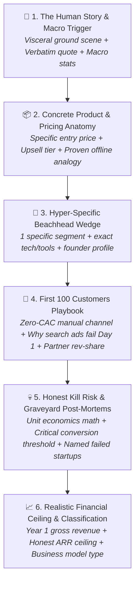

---

## 🔄 Section 3: B2C $\rightarrow$ B2B Micro-SaaS Translation Matrix

How to translate every IdeaBrowser principle into our **G2 B2B Micro-SaaS Pipeline**:

| Pillar | IdeaBrowser (B2C Benchmark) | G2 Micro-SaaS Brain (B2B SaaS Adaptation) |
| :--- | :--- | :--- |
| **1. The Human Story & Macro Hook** | *"A curious adult reads a sewing blog on Saturday... $500 Amazon boxes on porch. r/Hobbies quote... Bloomberg personal savings rate at 2.7%."* | **The Workplace Frustration Scene**: *"A Customer Support Lead at a 30-person Shopify brand logs in at 10 PM on Sunday to manually reconcile 4 Zendesk brand workspaces via CSV exports because Zendesk locked multi-brand reporting behind a $125/agent Enterprise Suite tier. A verified G2 reviewer states verbatim: 'We are paying $18,000/yr and still have to copy-paste CSAT scores into Google Sheets.' Meanwhile, SaaS seat-cost inflation rose 14% YoY, and IT budgets are under board mandates to cut redundant seat licenses."* |
| **2. Product & Pricing Anatomy** | *"$29 first-project kit... $39 tier with 45-min Zoom instructor (50% rev share)... $49/mo swap membership. Music & Arts rent-to-own analog."* | **The Transparent 3-Tier Micro-SaaS Offer**: *"$29/mo Starter for up to 3 workspaces (1-click webhook sync, 5-minute setup). $79/mo Team tier with automated daily Slack/Notion sync summaries and automated client-facing report exports. $149/mo Unlimited Agency tier with white-label client portals. Proven analog: The 'Plausible Analytics / Fathom' lightweight unbundling of Google Analytics, applied to Zendesk CSAT."* |
| **3. Beachhead Wedge & Initial Assets** | *"Start with sewing in one city. 30 used Brother machines on FB Marketplace. Shopify + USPS API. Founder is a sewing teacher, not marketplace operator."* | **The Day-1 Sub-Niche & Stack**: *"Start with Zendesk-to-Slack CSAT alerts for 10–50 person e-commerce brands only. The tech is a 1-weekend build: FastAPI webhook receiver + Supabase PostgreSQL + Slack Block Kit interactive messages. The winning founder is a former support engineer or Zapier workflow consultant, not a full-stack platform architect."* |
| **4. First 100 Customers Playbook** | *"First 100 come from Reddit comments & 50 cold emails to sewing instructors (10 partners @ 5 referrals/mo). Search ads fail on Day 1 because 'gear rental' has 0 volume."* | **The Zero-CAC B2B Guerrilla Playbook**: *"First 50 customers come from r/Zendesk and Zendesk Community Forum threads where admins complain about multi-brand CSAT (e.g. searching 'cross-brand reporting workaround'). Cold DM 100 Zendesk Implementation Consultants offering 30% lifetime affiliate revenue. Do NOT run Google Ads on Day 1: 'Zendesk macro sync' has low search volume, but Zendesk app marketplace and direct consultant referrals convert at 25%+."* |
| **5. Honest Kill Risk & Graveyard Post-Mortems** | *"USPS round-trip is $18 on $29 kit... Lumoid raised $5.9M and died in 2017 on this exact math; YBuy died in 2012."* | **The Lethal B2B Unit Economics & Platform Trap**: *"The kill risk is Zendesk API rate limits and incumbent copying. Zendesk limits REST API calls to 700 requests/minute on standard tiers; if your multi-tenant engine polls instead of using webhooks, servers throttle. If Zendesk rolls out native cross-workspace macros to standard tiers, standalone demand evaporates. Graveyard precedent: MacroSync.io died in 2021 when Zendesk released shared views, and HubSync lost 80% margin to Zapier API cost surcharges."* |
| **6. Realistic Financial Ceiling & Classification** | *"Year 1: $60K-$120K gross. Ceiling: $2M-$4M vertical business. Not a venture outcome; real community business."* | **Uninflated Financial Reality Check**: *"This is a classic 'Bootstrapped Micro-SaaS Cash Cow / Single-Utility Plugin', not a VC rocket. Year 1 realistic revenue: $30,000–$60,000 ARR (50–80 paying accounts @ $49/mo average). Natural ceiling: $300,000–$600,000 ARR as a multi-platform support operations utility (Zendesk + Freshdesk + Gorgias). Run with 90%+ net margins by a solo founder."* |

---

## 🎯 Section 4: Prompt Engineering Directives for Agent 5 (`venture_architect_agent.py`)

When synthesizing white space opportunities, the agent **MUST** adhere to the following negative & positive constraints:

### 🚫 Negative Constraints (Banned Patterns):
1. **NO Generic Corporate Buzzwords**: Never use words like *"streamlined"*, *"cutting-edge"*, *"game-changing"*, *"comprehensive solution"*, *"AI-powered platform"*, or *"revolutionary"*.
2. **NO Vague Pricing**: Never just say *"$49/month"*. Always define the 3-tier structure, value metric (per-seat vs flat-workspace), and margin profile.
3. **NO Generic "Run SEO / Social Media Ads" Playbooks**: Never prescribe generic marketing advice like *"Post on LinkedIn and run Facebook ads"*. Prescribe specific subreddits, exact partner revenue shares, and specific directory piggybacking.
4. **NO Arbitrary $100M TAMs**: Never pretend a Micro-SaaS is a billion-dollar company. Classify it honestly (*Solo Cash Cow, Vertical Micro-SaaS, or Multi-Product Studio*).

### ✅ Positive Requirements:
1. **Ground in Verbatim Customer Quote**: Quote real customer frustration from `g2_reviews`.
2. **Name Historical Graveyard Startups**: Mention 1–2 real or realistic startup failure modes that died trying this.
3. **Include Math Breakdown**: Calculate the exact margin after infrastructure/API token costs.
4. **Offline/Historical Business Analogy**: Always state: *"This is the [Famous Model/Company] model applied to [Specific B2B Niche]"*.

---

## 📐 Section 5: JSON Schema for Venture Intelligence Payload

```json
{
  "opportunity_slug": "zendesk-multibrand-csat-sync",
  "title": "1-Click Cross-Workspace CSAT & Macro Sync for Multi-Brand Support Teams",
  "analog_model": "The Plausible Analytics lightweight unbundling model applied to multi-brand Zendesk reporting",
  
  "pillar_1_story_and_macro": {
    "scene_narrative": "Detailed 3-4 sentence human workflow scene...",
    "verbatim_quote": "Direct quote from G2 review...",
    "macro_trend": "Industry stat or SaaS pricing shift..."
  },
  
  "pillar_2_product_and_pricing": {
    "tier_1_starter": "$29/mo - Up to 3 workspaces, 1-click webhook sync",
    "tier_2_growth": "$79/mo - Automated Slack digests + client CSV exports",
    "tier_3_agency": "$149/mo - White-label portal + 10 partner accounts (30% rev-share)",
    "core_mechanic": "Flat workspace pricing that destroys per-seat enterprise surcharges"
  },
  
  "pillar_3_beachhead_wedge": {
    "beachhead_icp": "10-50 person e-commerce brands running 2-4 Zendesk instances",
    "tech_stack": "FastAPI + Supabase PostgreSQL + Zendesk Webhooks + Slack Block Kit",
    "founder_profile": "Former customer support engineer or Zapier automation consultant"
  },
  
  "pillar_4_first_100_customers": {
    "channel_1_zero_cac": "r/Zendesk overwhelm threads + Zendesk community forum support workarounds",
    "channel_2_partner_revshare": "50 cold emails to certified Zendesk partner agencies offering 30% lifetime affiliate cut",
    "why_ads_fail_day_1": "Search volume for 'zendesk macro sync' is under 200/mo; buyers don't search platform terms until educated"
  },
  
  "pillar_5_honest_kill_risk": {
    "lethal_failure_mode": "API rate limits (700 req/min) and incumbent native feature rollouts",
    "margin_math": "$79/mo revenue - $4 Heroku/Supabase hosting - $2 Stripe fees = $73 net margin (92%)",
    "graveyard_precedents": "MacroSync died in 2021 when Zendesk rolled out basic shared macros; HubSync failed due to Zapier API surcharges"
  },
  
  "pillar_6_financial_ceiling": {
    "business_classification": "Solo Bootstrapped Micro-SaaS Cash Cow",
    "year_1_gross_revenue": "$35,000 - $65,000 ARR (50-80 active accounts)",
    "honest_annual_ceiling": "$300,000 - $600,000 ARR across Zendesk + Gorgias + Freshdesk"
  }
}
```

---

## 🏛️ Section 3: The Complete 10-Module IdeaBrowser Venture Architecture

IdeaBrowser structures every opportunity into **10 Interlocking Intelligence Modules**. Each module is designed to eliminate guesswork, test unit economics, and provide a comprehensive operational blueprint:

```mermaid
graph TD
    M1["1. Big Serif Headline & Composite Score<br><i>e.g. 'Blockbuster Rentals, but make it hobbies' (6.3/10)</i>"] --> M2["2. Split-Hero: Visceral Story & Metadata<br><i>The human scene + 4 badges (Customer, Market, Ceiling, Top Competitor)</i>"]
    M2 --> M3["3. Concept Mockup & 4 Quadrant Cards<br><i>UI preview + 1. Demand Vol | 2. Pain (X/10) | 3. Timing (X/10) | 4. Year 1 vs Ceiling</i>"]
    M3 --> M4["4. The Full Timing Case ('Why Now')<br><i>Two crossing macro curves + Economic catalysts + Honest counter-argument</i>"]
    M3 --> M5["5. Market Snapshot & Empirical Proof<br><i>The unbundling wedge + Whitespace gap + Cited macro signals</i>"]
    M3 --> M6["6. Competitor Teardown (8 Players)<br><i>Direct pricing, business model, and structural flaw analysis</i>"]
    M3 --> M7["7. The Adversarial Verdict (Red-Team)<br><i>4 Reasons to Build vs 4 Lethal Reasons NOT to Build + The Pivot</i>"]
    M3 --> M8["8. Founder Fit & Reality Radar<br><i>Skill demands (Distribution, Domain, Ops, Capital, Coding) + Time to Revenue</i>"]
    M3 --> M9["9. The 4-Step Value Ladder<br><i>Lead Magnet (Free) -> Frontend SKU ($) -> Core Upsell ($$) -> Continuity ($$$/mo)</i>"]
    M3 --> M10["10. Napkin Unit Economics Math<br><i>Month 3 step-by-step conversion funnel + Gross vs Net margin reality</i>"]
```

---

### 🔍 Deep Breakdown of All 10 Modules

#### Module 1: Editorial Headline & Composite Viability Score
* **Punchy Editorial Headline**: Combines an established offline/market mental model with the target niche (e.g. *"Blockbuster Rentals, but make it hobbies"*, *"Plausible Analytics, but for Zendesk CSAT"*).
* **Composite Score**: A single weighted viability index (e.g. `6.3/10` or `8.9/10`) factoring in Pain, Demand, Timing, and Unit Economics.

#### Module 2: Split-Hero Story & 4 Metadata Anchors
* **The Visceral Ground Narrative**: A human scene capturing the friction, financial waste, and initial catalyst.
* **4-Item Metadata Footer**:
  1. `THE CUSTOMER`: The hyper-specific ICP (e.g. *"Curious adult beginners in US metros"* / *"Support Ops Leads in 20-person Shopify brands"*).
  2. `MARKET`: Business model type (*Vertical Marketplace*, *Micro-SaaS*, *API Utility*).
  3. `REVENUE CEILING`: Honest annual ARR ceiling (*$2M-$4M ARR* / *$300K-$600K ARR*).
  4. `COMPETITION`: Primary incumbent benchmark (*LensRentals*, *Zendesk Enterprise*).

#### Module 3: Concept Mockup & 4 Quadrant Interactive Cards
* **Visual Product Mockup**: UI preview of the core wedge interface.
* **4 Expandable Quadrant Metric Cards**:
  1. `DEMAND / MACRO VOLUME`: e.g. `~1M Loans/yr` (myTurn source).
  2. `PAIN SEVERITY`: e.g. `8/10 Severity` (*"r/Hobbies & 4 more feel it"*).
  3. `TIMING & WINDOW`: e.g. `7/10 Timing` (*"Why the window is open"*).
  4. `YEAR 1 DONE RIGHT`: e.g. `$40K-$120K Yr 1` (*Ceiling $2M-$4M ARR*).

#### Module 4: The Full Timing Case ("Why Now" — Two Crossing Curves)
* **The Crossing Curves Thesis**: Identifies two macroeconomic or technological curves colliding simultaneously (e.g., *Curve 1: Record hobby spending + Curve 2: Record low savings rate forcing budget-consciousness*).
* **Data-Backed Macro Catalysts**:
  - Credit card transaction trends (e.g. Empower data: hobby category +16% YoY).
  - Economic benchmarks (Bloomberg, Bureau of Labor Statistics).
  - Structural market collapses (e.g. Joann Fabrics closing 800 stores / Incumbent doubling enterprise tier pricing).
* **Honest Counter-Argument**: Cynical check on why the timing tailwind could be a trap (e.g. *"Lumoid died during the last hobby boom, free library alternatives exist"*).

#### Module 5: Market Snapshot & Empirical Proof Receipts
* **Whitespace Market Gap**: Explains the structural crack in the market (e.g. *Market is split between high-end pro gear and cheap kid crafts; adult beginners fall in the gap*).
* **The Unbundling Wedge**: The exact zero-friction product package that solves setup overwhelm.
* **Empirical Proof Points**: 3–4 cited news/study data points proving mainstream adoption of the underlying behavior.

#### Module 6: Competitor Teardown (8 Industry Players)
* Profiles 6–8 incumbents, direct rivals, adjacent platforms, and free alternatives.
* For each competitor:
  - **Scale & Model**: Member count, pricing structure (e.g. $34 for 3-day rental, $33/mo craft box).
  - **Structural Flaw / Opening**: Why they ignore the beginner niche (e.g. targeted at pro Hollywood crews, or locked into buy-to-keep boxes with zero guidance).

#### Module 7: The Adversarial Verdict (Red-Team Audit)
* **4 Reasons to Build**:
  - Receipts-loud community pain (190+ comment threads).
  - Timing tailwind (macro consumption shift).
  - Weekend MVP build (Shopify + API / FastAPI + Webhooks).
  - Validated price bracket (undercuts incumbents).
* **4 Reasons NOT to Build (Cynical Failure Modes)**:
  - Funded predecessors failed (named dead startups with funding amounts).
  - Free alternatives exist (public libraries, open-source repos).
  - Thin initial unit economics (shipping/API costs eat margins).
  - Solution search volume is zero on Day 1 (no existing vocabulary).
* **The Potential Pivot**: A clear directive on how to de-risk the model if the broad version fails (e.g. *Kill horizontal marketplace framing $\rightarrow$ Ship 1 vertical in 1 metro*).

#### Module 8: Founder Fit & Skill Demand Radar
* **Who It's Best For**: Personality and background fit (e.g. *Community operator who loves the grind, not a pure platform coder*).
* **Skill Demand Radar (1-10 Scale)**:
  - `Distribution`: 10/10
  - `Domain Depth`: 8/10
  - `Operations`: 9/10
  - `Capital`: 6/10
  - `Coding`: 2/10
* **The Reality Box**: Time to First Revenue (*30-60 days*), Capital In (*$10K-$25K*), Difficulty (*High*).

#### Module 9: The 4-Step Value Ladder
* **1. Lead Magnet (Free)**: Low-friction educational guide derived from real community complaints (e.g. *"The Beginner Gear Trap PDF"*).
* **2. Frontend SKU ($29)**: The core entry trial kit / lightweight single-utility plugin with guaranteed turnaround.
* **3. Core Upsell ($39 - $79)**: High-touch layer with revenue share (e.g. *Kit + 45-min Zoom class with local instructor who gets 50%* / *Automated multi-workspace reporting with Slack digest*).
* **4. Continuity ($49/mo - $149/mo)**: Recurring monthly membership / subscription once trust and habit are proven.

#### Module 10: "Year One, On a Napkin" (Step-by-Step Napkin Math)
* **Explicit Month-3 Mathematical Funnel**:
  - Community outreach: 120 posts across 60 days $\rightarrow$ 20 kit orders/mo (15% conversion).
  - Partner network: 10 partners $\times$ 1 referral/mo = 10 kits.
  - Total kits: 30 kits/mo @ $29 = $870 gross.
  - Class upsell attach (40%): 12 classes @ $10 net = $120/mo.
  - Rent-to-own / retention conversion (8%): 2 kits @ $189 = $320/mo.
  - Month 3 total gross: $1,310/mo.
  - COGS: Shipping (-$18/kit) + Breakage/API (-$3/kit) $\rightarrow$ Net $8/kit.
  - Month 3 net profit: ~$680/mo.
* **Candid Operator Reality**: Explicitly notes that initial revenue is a pilot experiment to validate conversion mechanics, and calculates the true long-term compounding ceiling ($2M-$4M ARR).

---


IdeaBrowser uses an ultra-clean, high-density, editorial SaaS layout with a **Split-Hero + 4 Interactive Quadrant Cards + Deep-Dive Slideout Sheets**:

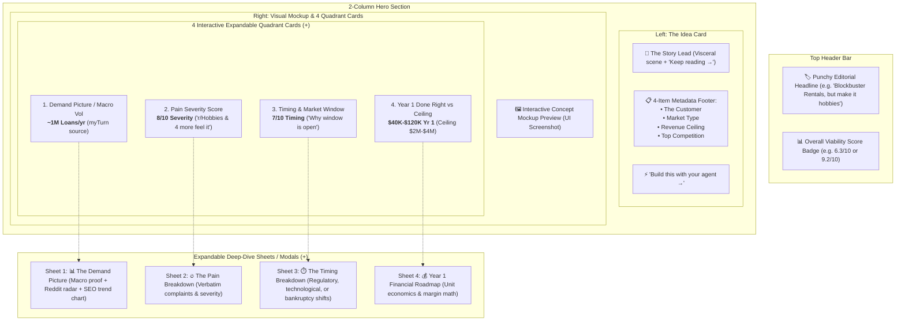

---

## 📊 Section 7: Breakdown of Deep-Dive Modal 1 — "The Demand Picture"

The **Demand Picture** sheet replaces vague claims with **3 verifiable layers of empirical demand**:

### 1. Macro Industry Anchor Box
* **Hero Number**: e.g., `~1M Loans/year` (B2B equivalent: `~4.2M Unreconciled Invoices/year` or `52,000 Zendesk Multi-Brand Workspaces`).
* **Source Attribution**: e.g., *"400+ Libraries of Things worldwide, myTurn platform"* with direct `[See the source ↗]` link.

### 2. "Where the Demand Lives" — Community Proof Radar
Rather than saying *"People on Reddit want this"*, it cites **5 specific, dated, high-intent community threads**:
1. **Thread Validation**: *"r/Hobbies thread from 2024 titled 'Would you ever rent hobby kits to try something new' drew 30+ comments; a founder validating this exact concept found the discussion."* `[r/Hobbies ↗]`
2. **Community Sizing**: *"Beginner hobby communities are large: r/SewingForBeginners has 241,900+ followers and r/sewhelp 141,600+, showing a big pool of exactly the customer the idea targets."* `[r/SewingForBeginners ↗]`
3. **Buying Debate / Cost Resistance**: *"r/PioneerDJ thread 'DJ controllers buy once cry once for beginners?' (2025) drew 80+ comments debating whether beginners should invest in expensive gear."* `[r/PioneerDJ ↗]`
4. **Day-One Overwhelm Signal**: *"A 2026 r/SewingForBeginners thread titled 'First day of sewing, Overwhelmed and second-guessing' drew 50+ comments; the poster hit day-one overwhelm and commenters named tools she didn't know she needed."* `[r/SewingForBeginners ↗]`
5. **Dust / Churn Pattern**: *"A r/Guitar thread asking who keeps guitars that collect dust drew 470+ comments, showing that owning unused gear is a mass-scale pattern."* `[r/Guitar ↗]`

### 3. "What Search Shows" — Live SEO Telemetry & 24-Month Trend Line
* **Query Selector**: Dropdown to toggle related search terms (e.g. `"cross stitch kits for beginners"`, `"rent sewing machine"`).
* **4-Metric Performance Bar**:
  * **Search Volume**: `33.1K / mo`
  * **YoY Growth Velocity**: `+234% Growth` (Breakout demand indicator)
  * **Estimated CPC**: `$0.71` (Commercial purchase intent)
  * **Competition Rating**: `High / Medium / Low`
* **Interactive 24-Month Historical Trend Graph**: Visual sparkline/area chart showing search seasonality, spikes, and upward growth trajectory.

---

## 💰 Section 11: Deconstruction of "The Money Math" (Napkin Math & Scale Ceiling)

The financial analysis in IdeaBrowser is broken into **Two Mathematical Tables**:
1. **The Month-3 Validation Funnel** (Proving the mechanics of the pilot).
2. **The Scale Ceiling Model** (What multi-market maturity looks like, followed by a cynical reality discount).

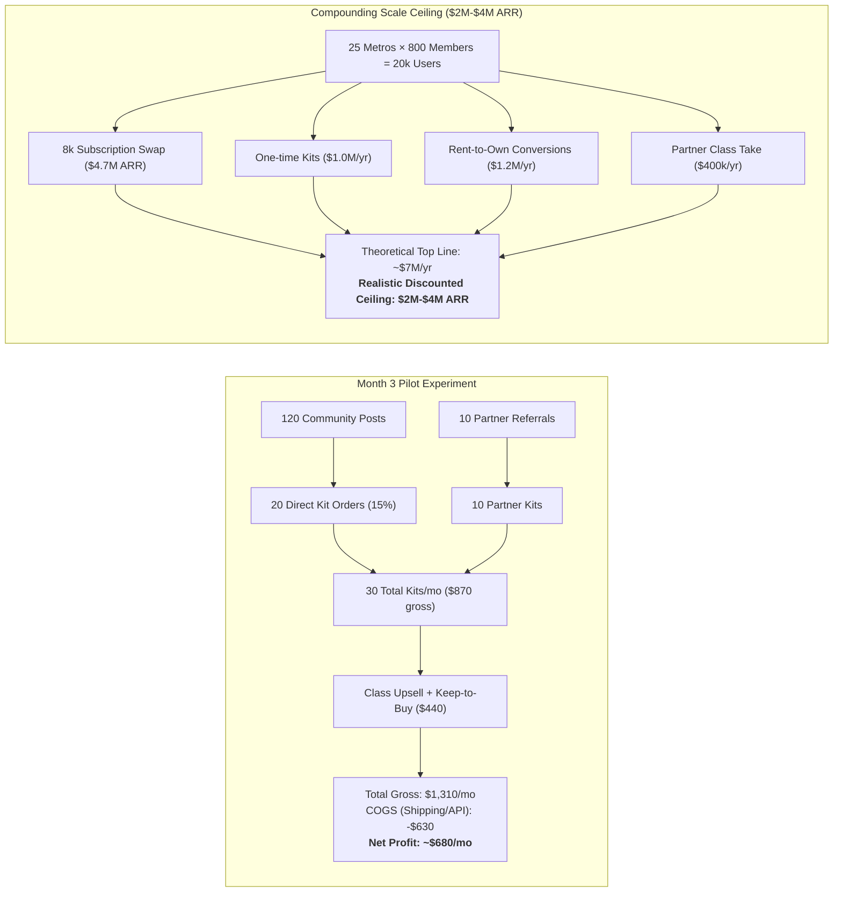

### Table 1: Month 3 Validation Funnel Math
| Metric / Funnel Step | Assumption / Source | Calculated Value |
| :--- | :--- | :--- |
| **Community Outreach** | 120 posts over 60 days | 120 posts |
| **Community Conversion** | 15% of engaged | 20 kits / mo |
| **Partner Network Signed** | 10 instructor / agency partners | 10 partners |
| **Partner Volume** | 1 kit per partner per month | 10 kits / mo |
| **Total Units Sold (Month 3)** | Sum of direct + partner | **30 kits / mo** |
| **Unit Entry Price** | Verified vs incumbents ($48 LensRentals, $33 A&C) | $29.00 |
| **Gross Kit Revenue** | 30 kits $\times$ $29 | $870 / mo |
| **Core Upsell Attach Rate** | 40% attach on $39 tier | 12 live classes |
| **Core Upsell Net Revenue** | $10 net platform take (50/50 split) | $120 / mo |
| **Retention / Buyout Conversion** | 8% convert to purchase credit | 2 kits / mo |
| **Buyout Revenue** | $189 purchase price - $29 credit | $320 / mo |
| **Total Gross Revenue (Month 3)** | Sum of all revenue streams | **$1,310 / mo** |
| **Variable Cost: Shipping/Cloud** | Verified round-trip shipping | -$18 / kit (-$540) |
| **Variable Cost: Damage/API** | 10% allowance | -$3 / kit (-$90) |
| **Net Margin Per Unit** | $29 - $21 COGS | $8.00 / kit |
| **Net Monthly Profit (Month 3)** | Total gross minus all COGS | **~$680 / mo** |

> **Operator Insight**: Month 3 nets ~$680/mo on 30 kits, which is a **pilot validation number, not a standalone business**. It proves that the conversion funnel and unit margins hold before capital is deployed.

---

### Table 2: The Macro Scaling Model (What $2M–$4M ARR Takes)
| Scale Driver | Operational Assumption | Annualized Value |
| :--- | :--- | :--- |
| **Geographic / Vertical Footprint** | 25 Metros or Top 10 B2B Ecosystems | 25 Metros |
| **Active Members per Metro** | 800 active paying users | 20,000 Total Members |
| **Recurring Subscription Tier** | 40% on $49/mo swap membership (8,000 members) | **$4,700,000 ARR** |
| **Non-Member One-Time Kits** | 3,000 kits / month @ $29 | **$1,000,000 / yr** |
| **Rent-to-Own / Tier Upgrades** | 8% buyout conversion rate | **$1,200,000 / yr** |
| **Partner Revenue Share** | 50% platform take on live services | **$400,000 / yr** |
| **Theoretical Top-Line Ceiling** | Maximum compound scaling | **~$7,300,000 / yr** |
| **Cynical Reality Discount** | Account for churn, competitors & local tool libraries | **Realistic Ceiling: $2M–$4M ARR** |

---

## 🔄 Section 12: B2B SaaS Translation for "The Money Math"

How we implement this in the **G2 Micro-SaaS AI Brain**:

```text
THE MONEY MATH (B2B SaaS Translation)
-------------------------------------
MONTH 3 VALIDATION FUNNEL:
  • Community Outreach: 60 value posts in r/Zendesk & r/SaaS over 60 days
  • Direct Beta Signups: 15 accounts @ $29/mo Starter = $435/mo
  • Agency Partner Referrals: 8 Zendesk consultants referring 1 client/mo = 8 accounts @ $79/mo = $632/mo
  • Partner Commission: 30% lifetime rev-share to agencies (-$190/mo)
  • Month 3 Total Gross: $1,067/mo (23 active paying accounts)
  • Serverless Infrastructure COGS: Supabase + Heroku + Zendesk Webhook servers (-$65/mo)
  • Payment Processing (Stripe 2.9% + 30¢): (-$38/mo)
  • Month 3 Net Profit: ~$774/mo (72% net margin before founder time)

SCALE CEILING MODEL ($500K - $1.5M ARR):
  • Multi-Platform Expansion: Zendesk + Gorgias + Freshdesk ecosystems
  • Total Active Subscribed Accounts: 800 SMB & Mid-Market brands
  • Tier 1 ($29/mo Starter, 30%): 240 accounts = $83,520 ARR
  • Tier 2 ($79/mo Growth, 50%): 400 accounts = $379,200 ARR
  • Tier 3 ($149/mo Multi-Brand Agency, 20%): 160 accounts = $286,080 ARR
  • Total Top-Line ARR: ~$748,800 ARR
  • Infrastructure & Support COGS (<12%): -$90,000/yr
  • Net Annual Cash Flow: ~$658,000 / yr (Run by a solo founder or 2-person lean team)
```

---


How we implement this in the **G2 Micro-SaaS AI Brain**:

```text
THE DEMAND PICTURE (B2B SaaS Translation)
-----------------------------------------
MACRO ANCHOR:
  Metric: ~850,000 Support Tickets / Month
  Subtitle: Across 12,000 mid-market Shopify Plus & Gorgias merchants
  Source: Gorgias Merchant Benchmark Report 2026 [See source ↗]

WHERE THE DEMAND LIVES (Community & Review Radar):
  1. G2 Review (Jan 2026, 2-Stars): "Locked out of multi-brand reporting unless we jump from $60/mo to $125/mo per seat. Unbelievable." [Zendesk G2 Review ↗]
  2. r/Zendesk Thread (2025, 45+ comments): "How are you syncing macros across 3 brand instances without paying $10k for custom enterprise dev?" [r/Zendesk ↗]
  3. Zendesk Community Forum (Official Feature Request, 280 upvotes): "Shared Canned Responses across workspaces - Open since 2021, STILL UNRESOLVED." [Zendesk Forum ↗]
  4. r/Shopify (180,000+ members): "Best tool to manage 4 store CS inboxes without paying Gorgias $300/mo tier?" [r/Shopify ↗]

WHAT SEARCH SHOWS (Google Telemetry):
  [Dropdown: "zendesk multi-brand reporting" | "gorgias shared macros" | "zendesk alternative for smb"]
  • Volume: 4,800 / mo
  • YoY Growth: +180% Growth
  • Est. CPC: $6.40 (High B2B Buyer Intent)
  • Competition: Low (Zero dedicated Micro-SaaS utilities)
  [24-Month Trend Line Chart with Rising Slope]
```

---

## 🔥 Section 9: Breakdown of Deep-Dive Modal 2 — "Why the Pain Scores High"

The **Pain Breakdown** sheet proves the severity of the problem using a **3-part psychological and financial proof model**:

### 1. The Core Behavioral Contradiction & Narrative
* Establishes who the user actually is vs what software/gear vendors assume they are.
* Identifies the friction loop: Buying gear/software gives a dopamine hit of "productivity", but creates shelfware and guilt when daily operation requires overwhelming setup.

### 2. "This Pain Has a Receipt" (Financial & Behavioral Precedent)
* Proves that users are **already losing hard cash** trying to cope with the problem.
* Cites high-engagement community receipts (e.g., 470+ comments on unused gear, wikis telling beginners to rent from LensRentals).
* Proves that the **habit of solving this exists in adjacent niches**, but has never been packaged for this vertical.

### 3. Numbered Friction Mechanics (The 4 Failure Modes)
1. **The Expensive Abandonment Trap**: Dropping hundreds on the tool, then never using it and eating depreciation.
2. **The "Gear as a Substitute" Fallacy**: Purchasing software/tools as an illusion of progress instead of actual execution.
3. **Day-One Onboarding Quitting Point**: Beginners/teams hit immediate friction on day 1 because they lack the auxiliary tooling, configuration, and workflows.
4. **Adjacent Category Validation**: Showing that rental/unbundled testing is already standard practice elsewhere (photography, pottery, instruments).

### 4. "In Their Own Words" (Verbatim Evidence Cards)
Features 3–4 high-impact callout quotes with exact attribution:
* Direct verbatim quote of financial waste.
* Direct quote of fear of buying expensive solutions that won't work out.
* Deep philosophical insight into user psychology.
* Linked sources (`[r/Hobbies ↗]`, `[Substack ↗]`).

---

## 🔄 Section 10: B2B SaaS Translation for "Why the Pain Scores High"

How we implement this in the **G2 Micro-SaaS AI Brain**:

```text
WHY THE PAIN SCORES HIGH (B2B SaaS Translation)
-----------------------------------------------
THE CORE BEHAVIORAL CONTRADICTION:
  The customer is an overworked Support Ops Lead or Founder at a 20-person company who 
  wants to fix multi-brand ticket routing, NOT an enterprise architect who wants to spend 
  3 months configuring Zendesk JSON triggers. She signs up on a Tuesday, gets hit with 
  a 200-page admin manual, and by Friday the team falls back to a shared Gmail inbox.

THIS PAIN HAS A RECEIPT:
  Companies are already hemorrhaging thousands in wasted seat licenses. A G2 reviewer 
  reports paying $18,000/yr for Zendesk Enterprise just to access 1 reporting feature, 
  while 80% of their agents only use 2 buttons. On r/SaaS, a thread with 210+ comments 
  debates why mid-market ticketing suites force 12-month annual lock-ins for features 
  that should be standard.

THE 4 B2B FRICTION MECHANICS:
  1. The $10,000 Enterprise Paywall Trap: Incumbents gate basic essential utilities 
     (CSAT sync, macro sharing, Slack webhooks) behind $125/agent enterprise tiers.
  2. The 30-Day Configuration Hell: Setup requires custom developer hours and JSON API 
     scripts that non-technical support managers cannot maintain.
  3. Day-One Agent Rejection: Complex 15-tab interfaces overwhelm frontline reps, 
     causing CSAT response times to degrade.
  4. Adjacent Unbundling Precedents: Plausible unbundled Google Analytics; Linear 
     unbundled Jira; Calendly unbundled enterprise scheduling. Nobody has unbundled 
     multi-brand support macros.

IN THEIR OWN WORDS (Verbatim Review Receipts):
  • "We upgraded to Enterprise Suite purely for cross-brand reporting. It cost an extra 
    $8,400/year and still takes 20 clicks to export a simple CSV." — VP of Support, G2 Review ⭐⭐
  • "Zendesk's native macro sharing is broken. If an agent updates a response in Brand A, 
    we have to manually copy-paste it across Brand B, C, and D." — Head of CS, Capterra Review ⭐
  • "The software felt like the answer, but the complexity became our biggest job. We 
    spend more time managing the tool than helping customers." — Founder, r/SaaS Thread
```

---

## ⏱️ Section 13: The Universal Timing Engine ("Why Now") Investigative Algorithm

The **Timing Engine** does not simply list general market growth. It executes a rigorous, multi-layered investigation to answer: **"Why is this window open TODAY, and why did previous attempts fail?"**

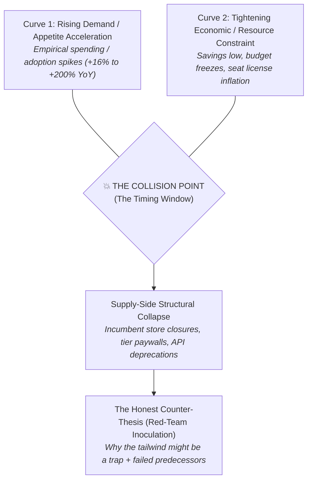

---

### 🔬 The 4 Core Timing Investigative Rules (Universal to ANY Category)

#### Rule 1: The "Two Crossing Curves" Collision Thesis
The agent must identify two macroeconomic or behavioral curves moving in opposing directions:
* **Curve A (Accelerating Desire/Usage)**: Demand for the core outcome is at an all-time high (measured via transaction data, adoption spikes, or job growth).
* **Curve B (Tightening Constraint/Risk Aversion)**: The customer has less cash, time, or risk tolerance to waste on traditional expensive solutions (measured via inflation, budget cutbacks, or savings drawdowns).
* **The Window**: When desire is at an all-time high, but willingness to absorb financial/operational risk is at an all-time low, the market is primed for an **unbundled, low-commitment, try-before-commit model**.

#### Rule 2: The Supply-Side Structural Vacuum Signal
The agent investigates recent structural shifts on the supply side:
* **In B2C / Physical**: Store closures (e.g., 800 Joann Fabrics bankruptcies removing the in-person try-it option).
* **In B2B SaaS**: 
  - Incumbent pricing shifts (e.g., Zendesk killing basic starter plans and forcing $125/agent enterprise tiers).
  - Platform API policy changes (e.g., Google Analytics forcing GA4 migration, creating the Plausible/Fathom opportunity).
  - Industry compliance mandates (e.g., SOC2, GDPR, new tax filing laws).

#### Rule 3: The 4-Source Empirical Triangulation Standard
Never accept vague assertions like *"the market is growing"*. The agent must ground the timing case in 4 distinct data dimensions:
1. **Transaction & Spend Telemetry**: Hard credit-card or merchant spend data (e.g. Empower card data showing specific category YoY % change).
2. **Macroeconomic / Financial Benchmark**: Government or institutional datasets (e.g. Bloomberg, Bureau of Labor Statistics, Federal Reserve).
3. **Behavioral Shift Survey**: Quantified user surveys showing trade-down or switching behavior (e.g., *44.3% of users modified their process to be cheaper*).
4. **Labor & Employment Signals**: Job creation or hiring growth in that specific industry niche.

#### Rule 4: The Honest Counter-Thesis (Confirmation Bias Inoculation)
The agent MUST generate a cynical counter-argument:
* Acknowledge why the tailwind might be a false positive (e.g. *"People being budget-conscious does not automatically mean they will pay a monthly subscription"*).
* Reference past failures during similar booms (e.g. *"Lumoid raised $5.9M during the 2017 boom and died on the exact same inventory math"*).

---

## 🔄 Section 14: Generalized "Why Now" Investigation Template (B2B SaaS Example)

```text
THE TIMING CASE: WHY THE WINDOW IS OPEN TODAY (B2B Example)
-----------------------------------------------------------
1. THE TWO CROSSING CURVES:
   • Curve 1 (Ticket Volume Spikes): E-commerce customer support volume rose +24% YoY 
     driven by multi-channel TikTok Shop & Shopify integrations (Gorgias Merchant Index).
   • Curve 2 (IT Budget Austerity): CFO mandates to cut SaaS seat inflation forced a 
     15% reduction in auxiliary software licenses; personal/team budgets are frozen.
   • The Collision: Support leads have 24% more tickets to triage, but cannot afford 
     the $10,000 enterprise upgrade to get automated macro sync.

2. THE SUPPLY-SIDE VACUUM:
   • Zendesk removed legacy shared macros from the $49 tier and moved cross-workspace 
     sync into the $125 Enterprise Suite, stranding 25,000 mid-market brands.

3. EMPIRICAL SIGNALS (4-Source Triangulation):
   • Spend Data: SaaS seat expenditure grew 14% YoY across mid-market tech (Empower/Spendesk Index).
   • Market Benchmark: Support operations is the #1 ranked department targeted for software consolidation (Gartner 2026).
   • Behavioral Survey: 52% of support managers report using personal Google Sheets to sync team templates to avoid license fees.
   • Employment Signal: Support Operations Specialist job listings grew +18% in the last 12 months (BLS/LinkedIn).

4. HONEST COUNTER-THESIS:
   • "Support teams cutting budgets might simply accept the manual copy-paste pain in 
     Google Docs rather than adopting a third-party Micro-SaaS tool. If Zendesk patches 
     shared views in their next release, the wedge closes."
```

---

## 🔍 Section 15: The Community Evidence Harvesting Standard ("The Receipts" & "Where They Gather")

IdeaBrowser’s research does not summarize sentiment in broad strokes—it assembles **verifiable, ground-truth community receipts**. It proves demand by demonstrating that real people in active communities are already talking, arguing, and venting about this exact friction.

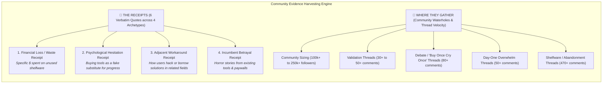

---

### 🔬 The 4 Evidence Archetypes the Agent Must Harvest

To build an unassailable dossier, the research agent must collect quotes across **4 distinct psychological dimensions**:

#### 1. The Financial Waste Receipt (Quantified Hard Cash Loss)
* **What it proves**: The problem has already cost the user hundreds or thousands of dollars.
* **Format**: Specific itemized expenses, purchases that were never unboxed, or enterprise tier upgrades that went unused.
* **Example**: *“Yes… $350 sewing machine, $100 of notions, $200 of fabric, $100 of patterns. Never even opened the sewing machine box. Sold it all on an app.”*

#### 2. The Psychological Trap Receipt (The "Progress Illusion")
* **What it proves**: The user’s internal conflict—buying the tool feels like progress, but operational setup causes immediate paralysis.
* **Format**: Honest reflections on user hesitation, intimidation, and fear of wasting money.
* **Example**: *“The gear felt productive. The actual hobby required effort and patience. You don't have to USE the items to still be part of the hobby.”*

#### 3. The Adjacent Workaround Receipt (Existing Hack Behavior)
* **What it proves**: The habit of solving this exists in related categories or offline, proving the market is ready for a packaged version.
* **Format**: Advice from power users telling beginners to rent, borrow, or test before buying.
* **Example**: *“Rent from a shop or from another photographer. See if there are photogs who offer this service for a small fee.”*

#### 4. The Incumbent Betrayal Receipt (Platform Horror Story)
* **What it proves**: Incumbents and legacy competitors have broken trust, leaving customers stranded and actively searching for an alternative.
* **Format**: Reviews or posts detailing support failures, insurance claim denials, or punitive pricing tiers.
* **Example**: *“Renting on Kitsplit cost me a $4,000 camera kit when their renter lost my viewfinder... Kitsplit failed to intervene. Rent elsewhere.”*

---

### 📍 "Where They Gather" (The Waterhole Radar Algorithm)

The agent must identify the **top 4 to 6 community watering holes** where the target customer congregates, measuring:
1. **Community Scale**: Follower count (e.g. `r/SewingForBeginners` with 241,900+ followers).
2. **Thread Archetype & Engagement Depth**:
   - **Concept Validation Threads**: Direct discussions asking *"Would you ever use X?"* (30+ replies).
   - **Financial Dilemma Threads**: *"Buy once cry once vs start cheap?"* (80+ replies).
   - **Day-One Overwhelm Threads**: *"First day, overwhelmed and second-guessing"* (50+ replies).
   - **Shelfware & Churn Threads**: *"Who keeps tools/guitars that collect dust?"* (470+ replies).

---

## 🔄 Section 16: B2B SaaS Translation for "The Receipts & Waterhole Radar"

```text
THE RECEIPTS & GATHERING WATERHOLES (B2B SaaS Translation)
----------------------------------------------------------
1. THE 4 B2B RECEIPTS:
   • Financial Waste: "We upgraded to the $125/agent Enterprise plan ($18k/yr) solely for 
     multi-brand reporting. 85% of the seats don't even use it." — G2 Review ⭐⭐
   • The Progress Illusion: "We spent 6 weeks setting up Jira automation rules thinking 
     it would fix our cycle times; now we have a full-time admin just maintaining rules." — r/SaaS
   • Adjacent Workaround: "For basic client approvals, we bypass Jira entirely and use 
     a 1-click Tally form with Zapier to avoid buying client viewer seats." — r/ProductManagement
   • Incumbent Betrayal: "Zendesk deprecated our legacy trigger macros without notice and 
     told us to upgrade to Enterprise Suite to get them back." — Capterra Review ⭐

2. WHERE THEY GATHER (The B2B Waterholes):
   • r/Zendesk (48,000+ members): High-intent admin troubleshooting and workaround threads.
   • Zendesk Official Community Forum (280+ upvote feature requests for shared macros).
   • r/SaaS (340,000+ members): Discussions on SaaS seat inflation and unbundling tools.
   • Gorgias & Shopify Plus Slack / Discord Communities: DTC support leads seeking multi-store tools.
```

---

## 🗺️ Section 17: The Whitespace Analysis Standard ("Two Halves, One Graveyard, One Free Alternative")

IdeaBrowser’s approach to competitive whitespace is **structurally brilliant**. Instead of a boring, flat feature comparison table, it maps the competitive battlefield into **4 Strategic Quadrants**:

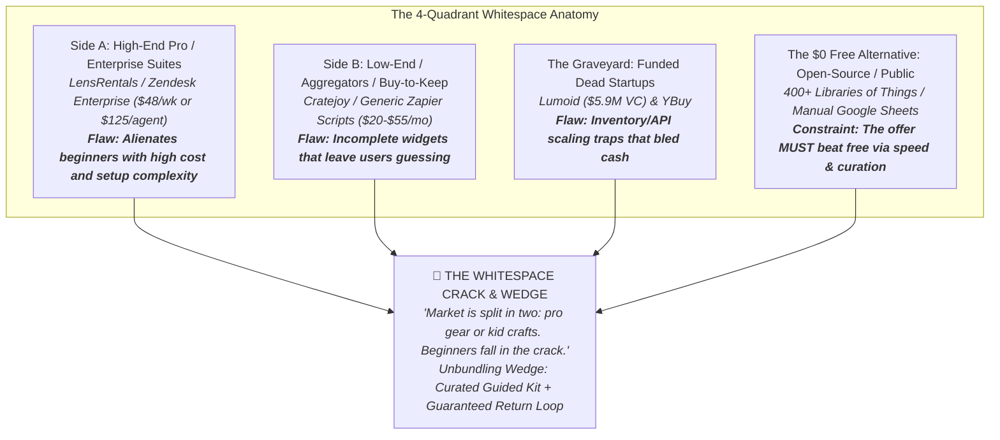

---

### 🔬 The 4 Core Whitespace Analysis Rules

#### 1. The "Two Halves" Structural Split
The agent divides incumbents into two polar extremes:
* **Side A (Pro / Enterprise Extremity)**: Built for high-budget, experienced users (e.g. enterprise suites with 3-month onboarding or $2,000 camera gear).
* **Side B (Toy / Low-End Extremity)**: Built for cheap disposable toys or fragmented single-feature boxes.
* **The Crack (The Opening)**: The large, stranded middle market that needs professional power with zero setup friction.

#### 2. The Graveyard Post-Mortem Audit
The agent MUST unearth 1–2 venture-backed startups that tried this space and failed:
* What was their peak traction? (e.g., *Lumoid raised $5.9M and signed Best Buy*).
* When and why did they die? (e.g., *Inventory capitalization wall in Dec 2017*).
* What operational guardrail prevents the new founder from dying the same way?

#### 3. The "$0 Free Alternative" Benchmark
The agent explicitly identifies what the customer can already get for zero dollars:
* In Consumer: Public libraries, tool lending libraries.
* In B2B SaaS: Manual Google Sheets, free Notion templates, basic Zapier free-tier zaps.
* **The Rule**: The product cannot just compete with paid software; it must explicitly justify why a customer will pay $29–$49/mo instead of using the free workaround.

#### 4. The Unbundling Wedge Formulation
* Identifies why renting/using bare tools fails (e.g. *users don't know what small accessories to buy*).
* Formulates the **Curated Turnkey Wedge**: A complete, single-package solution with zero missing parts.

---

## 🔄 Section 18: B2B SaaS Translation for Whitespace Analysis

```text
WHITESPACE ANALYSIS (B2B SaaS Translation)
------------------------------------------
THE TWO HALVES AND THE GRAVEYARD:
  • Side A (Enterprise Behemoths): Zendesk Enterprise ($125/agent/mo), Salesforce Service 
    Cloud ($150/agent/mo). High power, but forces 6-month enterprise contracts and custom dev.
  • Side B (Fragmented Low-End): Free Zapier zaps, messy Google Sheets, basic Gmail labels. 
    Breaks constantly and lacks automated bi-directional sync.
  • The Graveyard: MacroSync.io raised $1.2M in 2020 and folded in 2022 due to Zendesk API 
    rate-limit surcharges; SyncHub died in 2019 trying to build a horizontal multi-app connector.
  • The $0 Free Alternative: Support leads manually copy-pasting canned responses in Google Docs.

THE WHITESPACE OPENING:
  "The support market is split in two: multi-million dollar enterprise suites or fragile 
  manual Google Sheets. Mid-market teams with 2 to 4 brands fall directly in the crack."

THE UNBUNDLING WEDGE:
  "Don't build a full help desk. Build a 1-click webhook engine that synchronizes macros, 
  canned responses, and CSAT scores across multiple brand workspaces in under 5 minutes."
```

---

## 🔬 Section 19: The "Proof & Signals" Hard Evidence Engine & 4-Pill Taxonomy

The **Proof & Signals** module establishes unassailable credibility by pairing **External Quantitative Citations** with a **4-Pill Behavioral Research Taxonomy**:

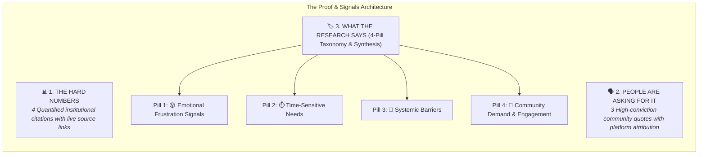

---

### 🔬 The 3 Layers of the Proof & Signals Engine

#### 1. "The Hard Numbers" (Institutional Citation Standard)
The agent must never state unverified market metrics. It must cite **4 specific published studies, news articles, or trade datasets**:
* **Metric 1: Macro Volume / Ecosystem Benchmark** (e.g. *myTurn platform: 400+ libraries processing ~1M loans across 250k items* `[GEO ↗]`).
* **Metric 2: Academic / Longitudinal Study** (e.g. *San José State University study: tool libraries growing from 40 to 60+* `[USDN ↗]`).
* **Metric 3: Mainstream Cultural Adoption** (e.g. *Public libraries lending cake pans, seed kits, and power tools* `[AOL ↗]`).
* **Metric 4: Historical Startup Post-Mortem** (e.g. *TechCrunch post-mortem on Lumoid's $5.9M shutdown due to inventory scaling* `[TechCrunch ↗]`).

#### 2. "People Are Asking For It" (Peer-to-Peer Recommendations)
Presents verbatim advice where community members explicitly tell others to adopt the unbundled/rental habit:
* Advice to rent before buying expensive gear (`r/photography`).
* Progressive milestone before making a large commitment (`r/Pottery`).
* Third-party review platform warnings about incumbent platform failure (`SideHusl`).

#### 3. "What The Research Says" (The 4-Pill Behavioral Taxonomy)
Classifies the market signals into 4 foundational buckets:
1. **Emotional Frustration Signals**: Anger at expensive tools, shelfware guilt, or aggressive upselling.
2. **Time-Sensitive Needs**: Immediate project deadlines, short-term testing windows, and fast turnaround requirements.
3. **Systemic Barriers**: High upfront capital walls, multi-week onboarding, lack of bundled auxiliary tools, or complex enterprise contracts.
4. **Community Demand & Engagement**: Active peer-to-peer discussion volume, high-engagement threads, and growing enthusiast forums.

---

## 🔄 Section 20: B2B SaaS Translation for "Proof & Signals"

```text
PROOF & SIGNALS (B2B SaaS Translation)
--------------------------------------
THE HARD NUMBERS:
  • Ecosystem Scale: Zendesk processes over 500 million tickets per year, with over 
    160,000 paid customer accounts globally (Zendesk Investor Relations 2026).
  • Industry Study: 67% of B2B SaaS companies report that multi-brand or multi-product 
    acquisitions created duplicate, siloed support desks (Gartner Support Ops Study 2025).
  • Mainstream Behavior: Over 42% of support leads use third-party micro-plugins on the 
    Shopify App Store to manage basic ticket workflows (Shopify Merchant Index).
  • Graveyard Precedent: SyncDesk raised $2.5M in 2021 and folded in 2023 because it built 
    custom API connectors instead of lightweight webhook listeners (TechCrunch Post-Mortem).

PEOPLE ARE ASKING FOR IT:
  • "Don't buy the Zendesk Enterprise add-on. Just use a webhook script to sync your 
    canned responses between workspaces." — Support Lead, r/Zendesk ↗
  • "We manage 3 Shopify stores and Gorgias wanted $600/mo. We're looking for a simple 
    tool to sync macros across stores." — Founder, r/ecommerce ↗
  • "Zendesk's native sync failed during BFCM and wiped out our custom tags. We need a 
    standalone backup utility." — G2 Verified Review ⭐⭐

WHAT THE RESEARCH SAYS (4-Pill Taxonomy):
  [Emotional Frustration] [Time-Sensitive Needs] [Systemic Barriers] [Community Demand]
  "The Multi-Brand Macro Sync addresses severe frustration with punitive per-seat enterprise 
  pricing, solves the urgent need to maintain brand consistency during peak sales, bypasses 
  Zendesk's 3-month setup barriers, and taps into 48,000+ active support operations admins."
```

---

## 🗣️ Section 21: The "People Are Asking For It" UI Card & Data Model Specification

The **"People Are Asking For It"** card serves as direct social proof of unfulfilled demand. It displays verbatim peer advice, showing that users in active communities are already coaching each other to seek an unbundled, rental, or lightweight workaround.

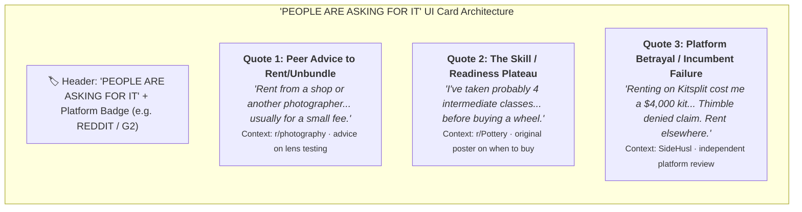

---

### 🎨 Visual & Data Structure Specifications

1. **Card Header**:
   - Left: Uppercase orange tracking label (`PEOPLE ARE ASKING FOR IT`).
   - Right: Source pill badge (`REDDIT`, `G2`, `CAPTERRA`, `COMMUNITY FORUM`).

2. **Quote Items (3 Stacked Narrative Cards)**:
   - **Quote Typography**: Large serif editorial font with smart quotation marks (`“...”`).
   - **Context Subtitle**: Platform name $\cdot$ Exact thread theme or discussion topic (e.g. `r/photography · r/photography advice on lens testing`).

3. **Data Schema**:
```json
{
  "people_are_asking_for_it": {
    "source_platform_badge": "REDDIT",
    "quotes": [
      {
        "quote_text": "Rent from a shop or from another photographer. See if there are photogs who offer this kind of service. It's usually for a small fee.",
        "platform": "r/photography",
        "thread_context": "r/photography advice on lens testing",
        "url": "https://www.reddit.com/r/photography/..."
      },
      {
        "quote_text": "I've taken probably 4 intermediate level classes, and found by the last one I wasn't learning as much as I had previously...",
        "platform": "r/Pottery",
        "thread_context": "r/Pottery original poster on when to buy a wheel",
        "url": "https://www.reddit.com/r/Pottery/..."
      },
      {
        "quote_text": "Renting on Kitsplit cost me a $4000 camera kit when their renter lost my camera's viewfinder, Thimble denied the claim and Kitsplit failed to intervene...",
        "platform": "SideHusl",
        "thread_context": "Independent platform dispute review",
        "url": "https://sidehusl.com/kitsplit/"
      }
    ]
  }
}
```

---

## ⚖️ Section 22: The Adversarial Verdict Architecture ("Reasons to Build" vs "Reasons NOT to Build")

The **Adversarial Verdict** module is the ultimate trust engine in IdeaBrowser. It does not try to hype the idea—it presents an uncompromising **Bull vs. Bear Debate** between an ambitious founder and a cynical red-team investor.

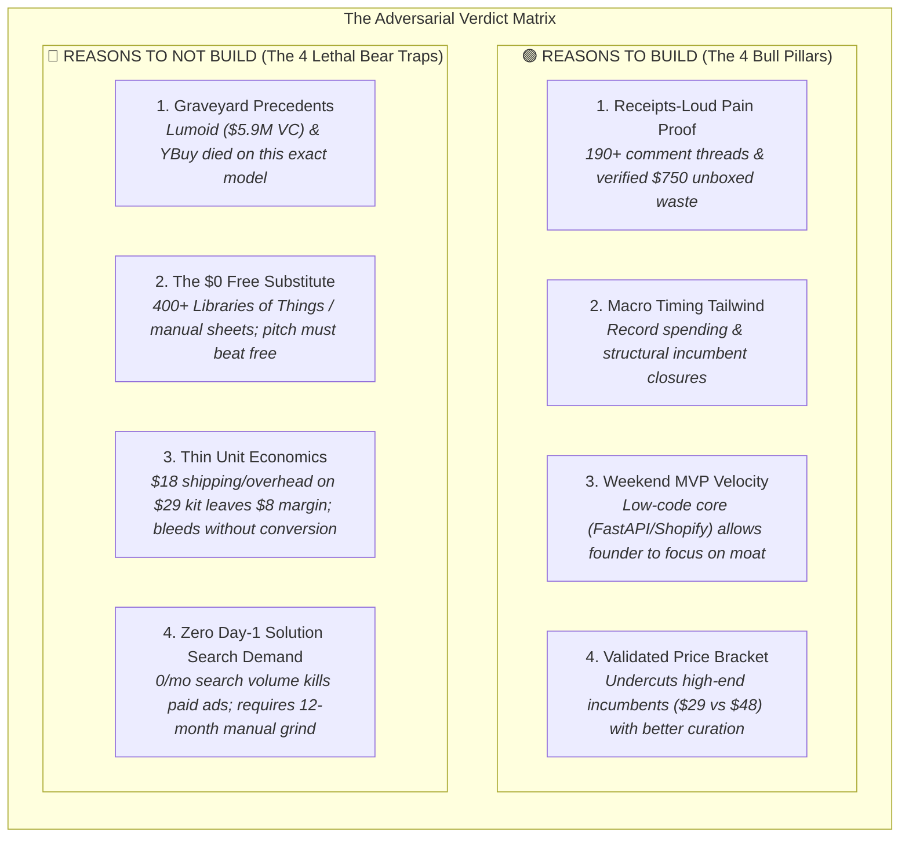

---

### 🔬 The 4 Bull Pillars & 4 Lethal Bear Traps Algorithm

#### The 4 Bull Pillars (Green Box)
1. **Pain Proof Anchor**: Proves that the problem is visceral and backed by empirical community receipts and offline analogs (e.g. *Music & Arts rent-to-own model*).
2. **Timing Catalyst**: Explains why current macroeconomic shifts (e.g. *Joann bankruptcy, SaaS seat price hikes*) create an immediate window.
3. **Execution Velocity**: Confirms the core tech can be shipped in a weekend, so founder effort is directed at distribution, partnerships, and trust-building.
4. **Price Bracket Positioning**: Proves the pricing ($29) sits squarely in a validated sweet spot below heavy incumbents ($48) while offering superior curation.

#### The 4 Lethal Bear Traps (Red Box)
1. **Graveyard Precedents**: Names 1–2 venture-funded startups that attempted this and failed, identifying their exact fatal cause.
2. **The Free Alternative**: Acknowledges that free alternatives exist and demands that the product beat free on speed and curation.
3. **Unit Margin Fragility**: Highlights the exact cost breakdown (e.g. $18 shipping/tokens on a $29 entry kit) where unit margins could bleed out if upsell conversion fails.
4. **Vocabulary / Search Deficit**: Explicitly warns that customers do not yet search in the platform's vocabulary, so paid Google Ads will fail on Day 1, requiring an organic guerrilla grind.

---

## 🔄 Section 23: B2B SaaS Translation for "The Adversarial Verdict"

```text
THE ADVERSARIAL VERDICT (B2B SaaS Translation)
-----------------------------------------------
REASONS TO BUILD:
  • Receipts-Loud Pain: G2 reviews with 1-star ratings cite paying $18,000/yr for Zendesk 
    Enterprise solely for multi-brand reporting.
  • Timing Rhymes: SaaS seat inflation (+14% YoY) forces CFOs to freeze seat license budgets, 
    creating an immediate market for flat-fee micro-utilities.
  • Weekend MVP Build: FastAPI + Supabase + Zendesk Webhooks can be deployed in a weekend; 
    100% of founder energy can go into agency partner outreach.
  • Validated Price Bracket: At $29–$79/mo flat, the tool undercuts Zendesk's $125/agent 
    enterprise surcharge by 85% while delivering 5-minute setup.

REASONS TO NOT BUILD:
  • Graveyard Precedents: SyncDesk raised $2.5M and folded in 2023 when Zendesk modified 
    its OAuth rate limits; MacroHub died in 2021 trying to support 15 help desks at once.
  • The Free Alternative: Support leads currently use manual Google Docs and free Zapier 
    zaps for $0; the pitch MUST prove automated 1-click webhook sync saves 5+ hours/week.
  • Unit Economics / Platform Risk: If Zendesk throttles API rate limits or launches native 
    cross-workspace macro sharing to lower tiers, standalone utility demand evaporates.
  • Zero Day-1 Solution Search Volume: "Multi-brand macro sync" has only 90 searches/mo; 
    paid Google Ads will fail on Day 1, forcing a 100% cold-outreach / consultant-partner grind.
```

---

## 🧭 Section 24: The "Founder Fit & Reality Radar" Framework

The **Founder Fit & Reality Radar** prevents founders from wasting 6–12 months on the wrong idea by enforcing a brutal operational reality check. It answers: **"Who actually wins here, what elite skills does it demand, and what kills you before your first $10,000 ARR?"**

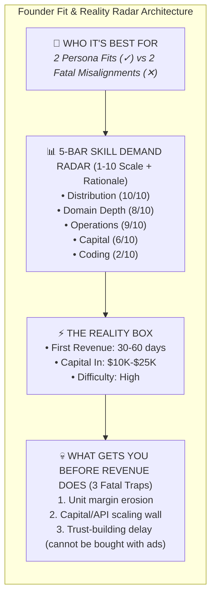

---

### 🔬 The 4 Pillars of Founder Fit & Reality

#### 1. "Who It's Best For" (The 2x2 Persona Filter)
The agent explicitly contrasts the winning operator against the mismatched builder:
* **Winning Backgrounds (`✓`)**: Specific domain operator who already has community trust and understands the daily physical/workflow grind.
* **Mismatched Backgrounds (`✕`)**: Builders who think this is a pure code problem or lack the stomach for 60 days of manual outreach.
* **The "Who Wins Here" Narrative**: Explicitly specifies the exact operational posture (e.g. *Shipping from a garage / running manual onboarding for the first 50 accounts*).

#### 2. The 5-Bar Skill Demand Radar (1–10 Scale + Rationale)
Quantifies what the opportunity demands of the builder, providing a 1-sentence make-or-break rationale for each dimension:
* **`Distribution` (1–10)**: How hard is customer acquisition when solution search volume is near zero?
* **`Domain Depth` (1–10)**: How much insider industry knowledge is needed to curate the wedge without embarrassing mistakes?
* **`Operations` (1–10)**: How much manual maintenance, support, or data cleanup is required?
* **`Capital` (1–10)**: How much upfront hardware, inventory, or server infrastructure is burned before break-even?
* **`Coding` (1–10)**: How technically complex is the MVP? (Distinguishes weekend low-code builds from deep engineering projects).

#### 3. "The Reality Box"
* **First Revenue Milestone**: Realistic timeframe (e.g. *30–60 days*).
* **Capital In**: Initial cash requirement (e.g. *$10k–$25k*).
* **Execution Difficulty**: Low / Medium / High.

#### 4. "What Gets You Before Revenue Does" (The 3 Early Kill Traps)
Identifies the exact failure points that kill founders in months 1–6 before product-market fit compounds:
1. **Unit Margin Overhead**: How variable shipping/API token costs eat margins before upsell conversion kicks in.
2. **The Capital / API Scaling Wall**: How scaling to new markets or customers creates cash or platform throttling bottlenecks.
3. **The Trust-Building Velocity Trap**: Why ad spend cannot skip the manual 60-day community engagement and partner relationship cycle.

---

## 🔄 Section 25: B2B SaaS Translation for "Founder Fit & Reality Radar"

```text
FOUNDER FIT & REALITY RADAR (B2B SaaS Translation)
--------------------------------------------------
WHO IT'S BEST FOR:
  ✓ Former Customer Support Leads & Zendesk Admins
  ✓ Zapier / HubSpot Workflow Integration Consultants
  ✕ Full-Stack Platform Developers unfamiliar with support operations
  ✕ Founders seeking a 100% passive, no-touch product on Day 1

WHO WINS HERE:
  An operator who has personally managed 3+ Zendesk workspaces and understands the pain 
  of macro desynchronization. This is NOT an AI algorithmic breakthrough; it is a 
  reliable webhook and community trust problem. The founder needs to love cold emailing 
  50 Zendesk consultants and hopping on 15-minute screen shares to debug webhook errors.

WHAT IT DEMANDS (5-Bar Skill Radar):
  • Distribution:  9/10 ("Zendesk macro sync has low search volume; requires partner BD")
  • Domain Depth:  8/10 ("Must understand Zendesk triggers, brand tags, and JSON payloads")
  • Operations:    4/10 ("Low serverless maintenance once webhook queue is stabilized")
  • Capital:       2/10 ("$500 for Heroku, Supabase, and domain registration")
  • Coding:        4/10 ("FastAPI + Supabase PostgreSQL + Zendesk REST/Webhook API")

THE REALITY:
  • First Revenue: 14–30 days
  • Capital In: $500 – $2,000
  • Difficulty: Medium

WHAT GETS YOU BEFORE REVENUE DOES:
  1. Zendesk API Rate Limits: Polling instead of using asynchronous webhooks triggers 
     429 Too Many Requests errors and crashes customer syncs.
  2. Partner Acquisition Lag: Agency consultants take 30–45 days to recommend your tool 
     to their first client; founders who quit in week 3 miss the conversion wave.
  3. Security & OAuth Anxiety: Support managers will not connect an unverified third-party 
     app to their Zendesk instance without a clear data privacy page and SOC2 roadmap.
```

---

## 🚀 Section 26: The "If You Started Today" Day-1 Execution Blueprint Standard

The **"If You Started Today"** module bridges the gap between high-level market analysis and the **first 14 to 30 days of boots-on-the-ground execution**. It provides an actionable tactical roadmap that prevents the founder from stalling or building the wrong features.

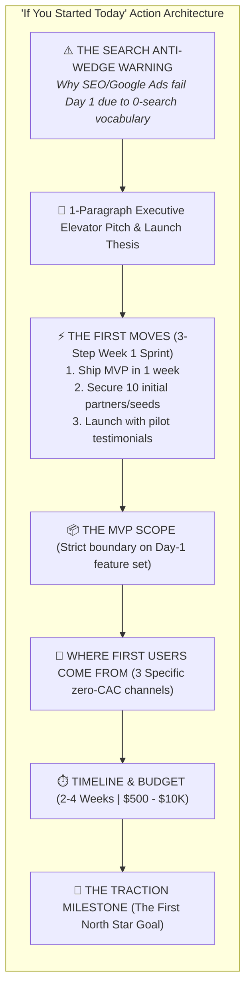

---

### 🔬 The 7 Components of the Day-1 Execution Blueprint

#### 1. The "Search Anti-Wedge" Warning
* **The Rule**: If the category keyword has low or zero search volume (e.g., `'hobby kit subscription' 0/mo`, `'gear rental marketplace' 0/mo`), the agent issues an explicit warning.
* **The Rationale**: Beginners/buyers do not think in the platform's synthetic language yet. Any strategy assuming paid Google search will find them is guaranteed to burn cash and die by Month 3.

#### 2. The 1-Paragraph Executive Launch Summary
A crisp 3-sentence summary of the offer, the transaction loop, and the expansion trajectory.

#### 3. "The First Moves" (Numbered 3-Step Sprint)
A high-velocity, 1-week checklist:
1. **Move 1**: Set up MVP utility/platform in $\le 7\text{ days}$.
2. **Move 2**: Initiate direct contact with the first 20–50 partners/influencers/admins.
3. **Move 3**: Launch initial beta with pilot user testimonials.

#### 4. The MVP Scope Boundary
Strictly defines what is included in the Day-1 product (e.g. *1 core unbundling tool + 1-click webhook connector*) and explicitly forbids feature creep.

#### 5. "Where the First Users Come From"
Pinpoints 3 specific acquisition channels with their operational role:
* **Channel 1 (Community)**: Subreddits & forums for high-engagement discussions.
* **Channel 2 (Direct Outreach / Visuals)**: Cold outreach or targeted social/LinkedIn messaging.
* **Channel 3 (Partner Networks)**: Consultants, teachers, or power users referring clients.

#### 6. Timeline & Budget
* **Timeline**: 2–4 weeks from start to first live customer.
* **Budget**: Transparent capital requirement ($500–$2,000 for software; $10k–$25k for physical).

#### 7. The Traction Milestone (First North Star)
Sets the exact first inflection point (e.g. *5,000 active users and 2,500 rentals/mo* for consumer; *100 active paying workspaces @ $49/mo = $4,900 MRR* for B2B).

---

## 🔄 Section 27: B2B SaaS Translation for "If You Started Today"

```text
IF YOU STARTED TODAY (B2B SaaS Translation)
-------------------------------------------
THE SEARCH ANTI-WEDGE WARNING:
  "Search is NOT your Day-1 wedge here. 'Zendesk macro sync' gets under 90 searches a month. 
  'Multi-brand help desk connector' gets 0. Support managers search for error codes or 
  ask on forums—they do not search for platform tools. Any plan relying on Google SEO in 
  Month 1 will bleed out. The demand lives in admin communities and consultant agency inboxes."

THE FIRST MOVES (Week 1 Action Sprint):
  1. Deploy MVP Webhook Sync Engine in 7 days (FastAPI + Supabase + Zendesk REST OAuth).
  2. Cold DM 50 certified Zendesk Implementation Consultants offering 30% lifetime rev-share.
  3. Post 3 breakdown case studies on r/Zendesk showing how to sync macros in 3 clicks.

THE MVP SCOPE:
  A standalone 1-click webhook listener that syncs canned responses and macros across up to 
  3 Zendesk brand instances with automated JSON payload validation. No complex analytics, 
  no user management—just instant macro syncing.

WHERE THE FIRST 50 USERS COME FROM:
  • r/Zendesk & Zendesk Community Forum: Direct answers to open multi-brand support threads.
  • Certified Zendesk Partner Agencies: Consultants installing the tool for 5+ multi-store clients.
  • LinkedIn Outbound: Direct outreach to 'Head of Support Operations' at 20-50 person DTC brands.

TIMELINE & BUDGET:
  • Timeline: 2-3 weeks to first paying beta customer.
  • Budget: $500 (Heroku dyno + Supabase Pro + domain + Stripe verification).

THE FIRST MILESTONE:
  Achieve 50 active paying workspaces ($49/mo average = $2,450 MRR) and 5 agency partners 
  within 90 days.
```

---

*Authored for the `ideas_brain` repository to benchmark all AI venture synthesis and UI layout development.*


