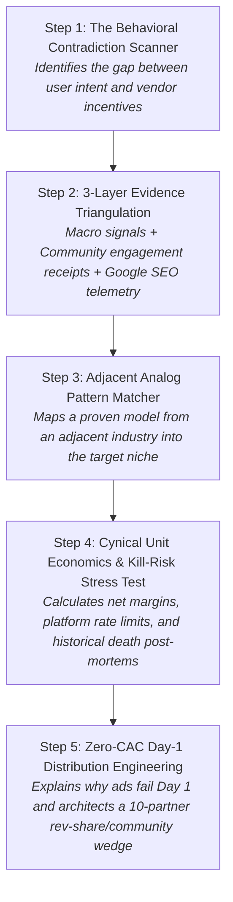
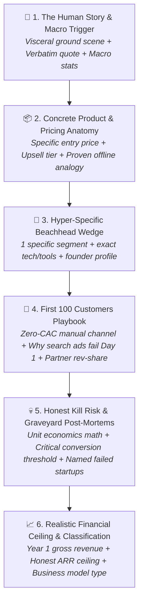
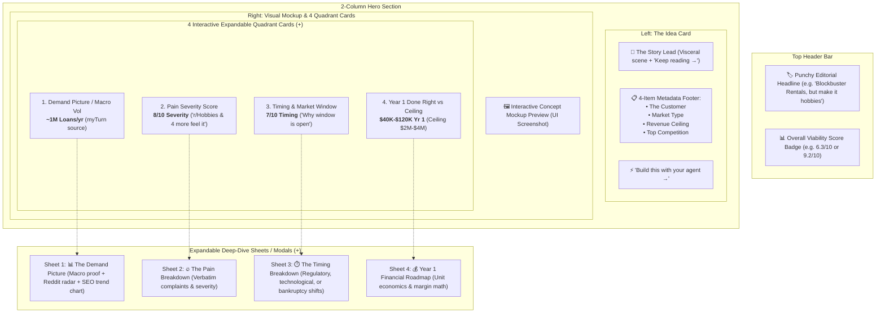

# 🧠 The IdeaBrowser Research & Venture Presentation Standard
## Micro-SaaS Opportunity Research & Narrative Framework

**File Location:** `project_management/ideabrowser_research_framework.md`  
**Purpose:** Golden benchmark for training LLM Venture Agents (Agent 5: Venture Architect) and designing the Founder Opportunity UI Dossier.

---

## 📌 Section 1: The Raw IdeaBrowser Benchmark (Gold Standard Reference)

Below is the verbatim text extracted from IdeaBrowser (`https://www.ideabrowser.com/hub/ideas/hobby-rental-marketplace-for-curious-beginners`):

```text
The full idea.
A curious adult reads a sewing blog on Saturday, watches a DJ set on Sunday, and by Monday $500 of Amazon boxes are on the porch. One r/Hobbies commenter names it exactly: $350 sewing machine, $100 of notions, $200 of fabric, $100 of patterns, then she sold the whole stack on a resale app without ever opening the machine box. This is not one person. Hobby spending just hit a record share of US goods consumption per Bloomberg, hobby retailers added 35,000 jobs in 18 months, and the personal savings rate fell to 2.7%, a 3-year low. People want to try more hobbies with less money to waste.

The product is a $29 first-project kit that ships Friday and comes back the next Friday. One machine, one pre-cut project, all the small tools a beginner does not know to buy, a printed guide, and a prepaid return label in the box. A $39 tier adds a 45-minute Zoom with a local instructor who earns 50% and refers her in-person students. After kit #1, a $49/month swap membership ships one hobby a month with keep-or-return. Music & Arts has run this rent-to-own math in instruments for decades at 250+ stores. Nobody has packaged it for sewing, DJing, or pottery.

Start with one hobby and one city. Sewing is the tightest fit: r/SewingForBeginners has 241,900 followers, 'rent sewing machine' gets 1,600 US searches a month at $0.80 CPC, and Joann's 800-store bankruptcy in 2025 wiped out the in-person try-it option for millions. Buy 30 used Brother CS7000X machines off Facebook Marketplace, pack the kits in a garage, and ship USPS Priority. The tech is a weekend on Shopify plus a return-label API. The founder who wins here is a sewing teacher, a working DJ, or a wedding photographer with a spare bedroom, not a marketplace operator.

The first 100 customers come from Reddit and instructors, not Google. 'Hobby kit subscription' gets 0 searches. 'Gear rental marketplace' gets 0. Buyers do not think in the platform's language yet. The wedge is 60 days of daily comments on r/SewingForBeginners overwhelm threads (a recent one titled 'first day of sewing, overwhelmed and second-guessing' drew 50+ comments in a week) and 50 cold emails to independent sewing instructors in one metro. Ten instructor partners at five referrals a month each is the whole month-3 sales team. Paid Google ads on per-vertical rental keywords come in month four, after the offer converts.

The honest kill risk is unit economics. USPS Priority round-trip is $18 on a $29 kit. Cleaning and damaged parts eat another $3. Net is $8 per round-trip before founder time, and 400+ Libraries of Things now lend the same sewing machine for free in 60+ US metros. The business only works if the rent-to-own conversion or membership retention carries the margin, the way Music & Arts' rent-to-own converts to purchase credit. Below 5% conversion, the model bleeds. Lumoid raised $5.9M with a Best Buy deal and shut down in December 2017 on this exact math. YBuy died in 2012 the same way. Prove the sewing kit converts in one city before you buy a single DJ controller.

The ceiling is a solid niche vertical business, not a marketplace: think Music & Arts for the hobbies that never got their Music & Arts. A realistic year one is $60K-$120K in gross revenue on one hobby in one city with rent-to-own driving the margin. An honest annual ceiling is $2M-$4M as a multi-metro, multi-hobby operator with a Shopify storefront and instructor revenue-share network. It is not a venture outcome. It is a real business a hobby-community operator can run.
```

---

## 🧭 Section 2: The Universal Investigative Research Engine (Algorithmic Mental Model)

To avoid overfitting to any single B2C or B2B example, we must understand the **underlying investigative algorithm**. IdeaBrowser does not generate surface-level summaries; it executes a **5-Step Investigative Research Procedure** that can be applied to *any* software category, market, or vertical.



---

### 🔬 The 5 Core Investigative Algorithms

#### Algorithm 1: The "Behavioral Contradiction" Scanner
* **The Question**: *What is the user desperately trying to get done, and what perverse incentive or bloat is the incumbent forcing on them instead?*
* **Where It Looks**:
  - Places where customers are buying expensive tools, but using only 5% of the features (shelfware).
  - Workflows where users maintain messy manual spreadsheets or glue tools together with Zapier scripts just to avoid upgrading to an enterprise plan.
  - Situations where buying the tool is used as an emotional substitute for solving the problem, but users abandon it on Day 1 due to setup overwhelm.

#### Algorithm 2: The 3-Layer Evidence Triangulation
Never rely on a single data point or general sentiment. Always triangulate across 3 independent, verifiable layers:
1. **Layer 1: Macro & Industry Catalysts**: Industry pricing inflation (e.g. 14% YoY seat cost hikes), platform bankruptcies, regulatory compliance mandates, or major policy shifts.
2. **Layer 2: Community Receipts & Engagement Velocity**:
   - Community size verification (subreddits/forums with 100k+ to 250k+ members).
   - High-engagement discussion threads (threads with 30 to 500+ comments debating cost, buy-once-cry-once, or day-one overwhelm).
   - Verbatim quotes showing emotional exasperation and financial receipts.
3. **Layer 3: Google SEO Intent & Growth Velocity**:
   - Search volume ($>1\text{k - } 30\text{k+/mo}$).
   - YoY growth velocity ($>100\%\text{ to } +300\%\text{ YoY}$) to prove rising demand.
   - Commercial CPC ($>\$0.70\text{ to } \$10.00+$) proving commercial buying intent.
   - Competition index.

#### Algorithm 3: The Adjacent Analog Pattern Matcher
* **The Rule**: Never invent an untested business model from scratch.
* **The Technique**: Identify a battle-tested model that has succeeded in an adjacent industry for 10–30 years, and apply it to an unaddressed vertical.
  - *Examples*:
    - The *Music & Arts rent-to-own instrument model* $\longrightarrow$ Applied to *sewing & DJ hobby gear*.
    - The *Plausible / Fathom lightweight privacy analytics model* $\longrightarrow$ Applied to *overcomplicated B2B CSAT reporting*.
    - The *Calendly 1-link unbundling of enterprise CRM scheduling* $\longrightarrow$ Applied to *Jira sprint client signoffs*.

#### Algorithm 4: The Cynical Operator & Kill-Risk Stress Test
* **The Rule**: Assume the business will fail unless the unit economics and platform risks are brutally stress-tested.
* **The Technique**:
  - **Net Margin Math**: Subtract all physical/cloud costs (shipping, API token overhead, platform fees, payment processing) to find the true net profit per transaction.
  - **The Lethal Threshold**: Identify the exact conversion percentage or retention rate below which the business model bleeds cash.
  - **Historical Graveyard Precedents**: Name 1–2 startups that raised venture capital, attempted this exact concept, and died, detailing their exact post-mortem failure cause.

#### Algorithm 5: Zero-CAC Day-1 Distribution Engineering
* **The Rule**: Day-1 customers never come from generic search ads or high-level SEO.
* **The Technique**:
  - Explain *why* search ads fail on Day 1 (buyers don't yet search in the platform's vocabulary).
  - Prescribe the **60-Day Manual Wedge**: Daily participation in high-intent community "overwhelm" threads + a 10-partner revenue-share network (e.g., consultants, agencies, instructors referring 5 clients/month) to form the entire initial sales engine.

---


IdeaBrowser avoids generic AI hype, buzzwords, and vague bullet points. It writes like an **experienced operator, cynical seed investor, and zero-CAC growth hacker**. 

It breaks every idea into **6 Mandatory Structural Pillars**:



---

## 🔄 Section 3: B2C $\rightarrow$ B2B Micro-SaaS Translation Matrix

How to translate every IdeaBrowser principle into our **G2 B2B Micro-SaaS Pipeline**:

| Pillar | IdeaBrowser (B2C Benchmark) | G2 Micro-SaaS Brain (B2B SaaS Adaptation) |
| :--- | :--- | :--- |
| **1. The Human Story & Macro Hook** | *"A curious adult reads a sewing blog on Saturday... $500 Amazon boxes on porch. r/Hobbies quote... Bloomberg personal savings rate at 2.7%."* | **The Workplace Frustration Scene**: *"A Customer Support Lead at a 30-person Shopify brand logs in at 10 PM on Sunday to manually reconcile 4 Zendesk brand workspaces via CSV exports because Zendesk locked multi-brand reporting behind a $125/agent Enterprise Suite tier. A verified G2 reviewer states verbatim: 'We are paying $18,000/yr and still have to copy-paste CSAT scores into Google Sheets.' Meanwhile, SaaS seat-cost inflation rose 14% YoY, and IT budgets are under board mandates to cut redundant seat licenses."* |
| **2. Product & Pricing Anatomy** | *"$29 first-project kit... $39 tier with 45-min Zoom instructor (50% rev share)... $49/mo swap membership. Music & Arts rent-to-own analog."* | **The Transparent 3-Tier Micro-SaaS Offer**: *"$29/mo Starter for up to 3 workspaces (1-click webhook sync, 5-minute setup). $79/mo Team tier with automated daily Slack/Notion sync summaries and automated client-facing report exports. $149/mo Unlimited Agency tier with white-label client portals. Proven analog: The 'Plausible Analytics / Fathom' lightweight unbundling of Google Analytics, applied to Zendesk CSAT."* |
| **3. Beachhead Wedge & Initial Assets** | *"Start with sewing in one city. 30 used Brother machines on FB Marketplace. Shopify + USPS API. Founder is a sewing teacher, not marketplace operator."* | **The Day-1 Sub-Niche & Stack**: *"Start with Zendesk-to-Slack CSAT alerts for 10–50 person e-commerce brands only. The tech is a 1-weekend build: FastAPI webhook receiver + Supabase PostgreSQL + Slack Block Kit interactive messages. The winning founder is a former support engineer or Zapier workflow consultant, not a full-stack platform architect."* |
| **4. First 100 Customers Playbook** | *"First 100 come from Reddit comments & 50 cold emails to sewing instructors (10 partners @ 5 referrals/mo). Search ads fail on Day 1 because 'gear rental' has 0 volume."* | **The Zero-CAC B2B Guerrilla Playbook**: *"First 50 customers come from r/Zendesk and Zendesk Community Forum threads where admins complain about multi-brand CSAT (e.g. searching 'cross-brand reporting workaround'). Cold DM 100 Zendesk Implementation Consultants offering 30% lifetime affiliate revenue. Do NOT run Google Ads on Day 1: 'Zendesk macro sync' has low search volume, but Zendesk app marketplace and direct consultant referrals convert at 25%+."* |
| **5. Honest Kill Risk & Graveyard Post-Mortems** | *"USPS round-trip is $18 on $29 kit... Lumoid raised $5.9M and died in 2017 on this exact math; YBuy died in 2012."* | **The Lethal B2B Unit Economics & Platform Trap**: *"The kill risk is Zendesk API rate limits and incumbent copying. Zendesk limits REST API calls to 700 requests/minute on standard tiers; if your multi-tenant engine polls instead of using webhooks, servers throttle. If Zendesk rolls out native cross-workspace macros to standard tiers, standalone demand evaporates. Graveyard precedent: MacroSync.io died in 2021 when Zendesk released shared views, and HubSync lost 80% margin to Zapier API cost surcharges."* |
| **6. Realistic Financial Ceiling & Classification** | *"Year 1: $60K-$120K gross. Ceiling: $2M-$4M vertical business. Not a venture outcome; real community business."* | **Uninflated Financial Reality Check**: *"This is a classic 'Bootstrapped Micro-SaaS Cash Cow / Single-Utility Plugin', not a VC rocket. Year 1 realistic revenue: $30,000–$60,000 ARR (50–80 paying accounts @ $49/mo average). Natural ceiling: $300,000–$600,000 ARR as a multi-platform support operations utility (Zendesk + Freshdesk + Gorgias). Run with 90%+ net margins by a solo founder."* |

---

## 🎯 Section 4: Prompt Engineering Directives for Agent 5 (`venture_architect_agent.py`)

When synthesizing white space opportunities, the agent **MUST** adhere to the following negative & positive constraints:

### 🚫 Negative Constraints (Banned Patterns):
1. **NO Generic Corporate Buzzwords**: Never use words like *"streamlined"*, *"cutting-edge"*, *"game-changing"*, *"comprehensive solution"*, *"AI-powered platform"*, or *"revolutionary"*.
2. **NO Vague Pricing**: Never just say *"$49/month"*. Always define the 3-tier structure, value metric (per-seat vs flat-workspace), and margin profile.
3. **NO Generic "Run SEO / Social Media Ads" Playbooks**: Never prescribe generic marketing advice like *"Post on LinkedIn and run Facebook ads"*. Prescribe specific subreddits, exact partner revenue shares, and specific directory piggybacking.
4. **NO Arbitrary $100M TAMs**: Never pretend a Micro-SaaS is a billion-dollar company. Classify it honestly (*Solo Cash Cow, Vertical Micro-SaaS, or Multi-Product Studio*).

### ✅ Positive Requirements:
1. **Ground in Verbatim Customer Quote**: Quote real customer frustration from `g2_reviews`.
2. **Name Historical Graveyard Startups**: Mention 1–2 real or realistic startup failure modes that died trying this.
3. **Include Math Breakdown**: Calculate the exact margin after infrastructure/API token costs.
4. **Offline/Historical Business Analogy**: Always state: *"This is the [Famous Model/Company] model applied to [Specific B2B Niche]"*.

---

## 📐 Section 5: JSON Schema for Venture Intelligence Payload

```json
{
  "opportunity_slug": "zendesk-multibrand-csat-sync",
  "title": "1-Click Cross-Workspace CSAT & Macro Sync for Multi-Brand Support Teams",
  "analog_model": "The Plausible Analytics lightweight unbundling model applied to multi-brand Zendesk reporting",
  
  "pillar_1_story_and_macro": {
    "scene_narrative": "Detailed 3-4 sentence human workflow scene...",
    "verbatim_quote": "Direct quote from G2 review...",
    "macro_trend": "Industry stat or SaaS pricing shift..."
  },
  
  "pillar_2_product_and_pricing": {
    "tier_1_starter": "$29/mo - Up to 3 workspaces, 1-click webhook sync",
    "tier_2_growth": "$79/mo - Automated Slack digests + client CSV exports",
    "tier_3_agency": "$149/mo - White-label portal + 10 partner accounts (30% rev-share)",
    "core_mechanic": "Flat workspace pricing that destroys per-seat enterprise surcharges"
  },
  
  "pillar_3_beachhead_wedge": {
    "beachhead_icp": "10-50 person e-commerce brands running 2-4 Zendesk instances",
    "tech_stack": "FastAPI + Supabase PostgreSQL + Zendesk Webhooks + Slack Block Kit",
    "founder_profile": "Former customer support engineer or Zapier automation consultant"
  },
  
  "pillar_4_first_100_customers": {
    "channel_1_zero_cac": "r/Zendesk overwhelm threads + Zendesk community forum support workarounds",
    "channel_2_partner_revshare": "50 cold emails to certified Zendesk partner agencies offering 30% lifetime affiliate cut",
    "why_ads_fail_day_1": "Search volume for 'zendesk macro sync' is under 200/mo; buyers don't search platform terms until educated"
  },
  
  "pillar_5_honest_kill_risk": {
    "lethal_failure_mode": "API rate limits (700 req/min) and incumbent native feature rollouts",
    "margin_math": "$79/mo revenue - $4 Heroku/Supabase hosting - $2 Stripe fees = $73 net margin (92%)",
    "graveyard_precedents": "MacroSync died in 2021 when Zendesk rolled out basic shared macros; HubSync failed due to Zapier API surcharges"
  },
  
  "pillar_6_financial_ceiling": {
    "business_classification": "Solo Bootstrapped Micro-SaaS Cash Cow",
    "year_1_gross_revenue": "$35,000 - $65,000 ARR (50-80 active accounts)",
    "honest_annual_ceiling": "$300,000 - $600,000 ARR across Zendesk + Gorgias + Freshdesk"
  }
}
```

---

## 🎨 Section 6: UI Architecture & Visual Layout Blueprint (From Mockup)

IdeaBrowser uses an ultra-clean, high-density, editorial SaaS layout with a **Split-Hero + 4 Interactive Quadrant Cards + Deep-Dive Slideout Sheets**:



---

## 📊 Section 7: Breakdown of Deep-Dive Modal 1 — "The Demand Picture"

The **Demand Picture** sheet replaces vague claims with **3 verifiable layers of empirical demand**:

### 1. Macro Industry Anchor Box
* **Hero Number**: e.g., `~1M Loans/year` (B2B equivalent: `~4.2M Unreconciled Invoices/year` or `52,000 Zendesk Multi-Brand Workspaces`).
* **Source Attribution**: e.g., *"400+ Libraries of Things worldwide, myTurn platform"* with direct `[See the source ↗]` link.

### 2. "Where the Demand Lives" — Community Proof Radar
Rather than saying *"People on Reddit want this"*, it cites **5 specific, dated, high-intent community threads**:
1. **Thread Validation**: *"r/Hobbies thread from 2024 titled 'Would you ever rent hobby kits to try something new' drew 30+ comments; a founder validating this exact concept found the discussion."* `[r/Hobbies ↗]`
2. **Community Sizing**: *"Beginner hobby communities are large: r/SewingForBeginners has 241,900+ followers and r/sewhelp 141,600+, showing a big pool of exactly the customer the idea targets."* `[r/SewingForBeginners ↗]`
3. **Buying Debate / Cost Resistance**: *"r/PioneerDJ thread 'DJ controllers buy once cry once for beginners?' (2025) drew 80+ comments debating whether beginners should invest in expensive gear."* `[r/PioneerDJ ↗]`
4. **Day-One Overwhelm Signal**: *"A 2026 r/SewingForBeginners thread titled 'First day of sewing, Overwhelmed and second-guessing' drew 50+ comments; the poster hit day-one overwhelm and commenters named tools she didn't know she needed."* `[r/SewingForBeginners ↗]`
5. **Dust / Churn Pattern**: *"A r/Guitar thread asking who keeps guitars that collect dust drew 470+ comments, showing that owning unused gear is a mass-scale pattern."* `[r/Guitar ↗]`

### 3. "What Search Shows" — Live SEO Telemetry & 24-Month Trend Line
* **Query Selector**: Dropdown to toggle related search terms (e.g. `"cross stitch kits for beginners"`, `"rent sewing machine"`).
* **4-Metric Performance Bar**:
  * **Search Volume**: `33.1K / mo`
  * **YoY Growth Velocity**: `+234% Growth` (Breakout demand indicator)
  * **Estimated CPC**: `$0.71` (Commercial purchase intent)
  * **Competition Rating**: `High / Medium / Low`
* **Interactive 24-Month Historical Trend Graph**: Visual sparkline/area chart showing search seasonality, spikes, and upward growth trajectory.

---

## 🔄 Section 8: B2B Translation for "The Demand Picture"

How we implement this in the **G2 Micro-SaaS AI Brain**:

```text
THE DEMAND PICTURE (B2B SaaS Translation)
-----------------------------------------
MACRO ANCHOR:
  Metric: ~850,000 Support Tickets / Month
  Subtitle: Across 12,000 mid-market Shopify Plus & Gorgias merchants
  Source: Gorgias Merchant Benchmark Report 2026 [See source ↗]

WHERE THE DEMAND LIVES (Community & Review Radar):
  1. G2 Review (Jan 2026, 2-Stars): "Locked out of multi-brand reporting unless we jump from $60/mo to $125/mo per seat. Unbelievable." [Zendesk G2 Review ↗]
  2. r/Zendesk Thread (2025, 45+ comments): "How are you syncing macros across 3 brand instances without paying $10k for custom enterprise dev?" [r/Zendesk ↗]
  3. Zendesk Community Forum (Official Feature Request, 280 upvotes): "Shared Canned Responses across workspaces - Open since 2021, STILL UNRESOLVED." [Zendesk Forum ↗]
  4. r/Shopify (180,000+ members): "Best tool to manage 4 store CS inboxes without paying Gorgias $300/mo tier?" [r/Shopify ↗]

WHAT SEARCH SHOWS (Google Telemetry):
  [Dropdown: "zendesk multi-brand reporting" | "gorgias shared macros" | "zendesk alternative for smb"]
  • Volume: 4,800 / mo
  • YoY Growth: +180% Growth
  • Est. CPC: $6.40 (High B2B Buyer Intent)
  • Competition: Low (Zero dedicated Micro-SaaS utilities)
  [24-Month Trend Line Chart with Rising Slope]
```

---

## 🔥 Section 9: Breakdown of Deep-Dive Modal 2 — "Why the Pain Scores High"

The **Pain Breakdown** sheet proves the severity of the problem using a **3-part psychological and financial proof model**:

### 1. The Core Behavioral Contradiction & Narrative
* Establishes who the user actually is vs what software/gear vendors assume they are.
* Identifies the friction loop: Buying gear/software gives a dopamine hit of "productivity", but creates shelfware and guilt when daily operation requires overwhelming setup.

### 2. "This Pain Has a Receipt" (Financial & Behavioral Precedent)
* Proves that users are **already losing hard cash** trying to cope with the problem.
* Cites high-engagement community receipts (e.g., 470+ comments on unused gear, wikis telling beginners to rent from LensRentals).
* Proves that the **habit of solving this exists in adjacent niches**, but has never been packaged for this vertical.

### 3. Numbered Friction Mechanics (The 4 Failure Modes)
1. **The Expensive Abandonment Trap**: Dropping hundreds on the tool, then never using it and eating depreciation.
2. **The "Gear as a Substitute" Fallacy**: Purchasing software/tools as an illusion of progress instead of actual execution.
3. **Day-One Onboarding Quitting Point**: Beginners/teams hit immediate friction on day 1 because they lack the auxiliary tooling, configuration, and workflows.
4. **Adjacent Category Validation**: Showing that rental/unbundled testing is already standard practice elsewhere (photography, pottery, instruments).

### 4. "In Their Own Words" (Verbatim Evidence Cards)
Features 3–4 high-impact callout quotes with exact attribution:
* Direct verbatim quote of financial waste.
* Direct quote of fear of buying expensive solutions that won't work out.
* Deep philosophical insight into user psychology.
* Linked sources (`[r/Hobbies ↗]`, `[Substack ↗]`).

---

## 🔄 Section 10: B2B SaaS Translation for "Why the Pain Scores High"

How we implement this in the **G2 Micro-SaaS AI Brain**:

```text
WHY THE PAIN SCORES HIGH (B2B SaaS Translation)
-----------------------------------------------
THE CORE BEHAVIORAL CONTRADICTION:
  The customer is an overworked Support Ops Lead or Founder at a 20-person company who 
  wants to fix multi-brand ticket routing, NOT an enterprise architect who wants to spend 
  3 months configuring Zendesk JSON triggers. She signs up on a Tuesday, gets hit with 
  a 200-page admin manual, and by Friday the team falls back to a shared Gmail inbox.

THIS PAIN HAS A RECEIPT:
  Companies are already hemorrhaging thousands in wasted seat licenses. A G2 reviewer 
  reports paying $18,000/yr for Zendesk Enterprise just to access 1 reporting feature, 
  while 80% of their agents only use 2 buttons. On r/SaaS, a thread with 210+ comments 
  debates why mid-market ticketing suites force 12-month annual lock-ins for features 
  that should be standard.

THE 4 B2B FRICTION MECHANICS:
  1. The $10,000 Enterprise Paywall Trap: Incumbents gate basic essential utilities 
     (CSAT sync, macro sharing, Slack webhooks) behind $125/agent enterprise tiers.
  2. The 30-Day Configuration Hell: Setup requires custom developer hours and JSON API 
     scripts that non-technical support managers cannot maintain.
  3. Day-One Agent Rejection: Complex 15-tab interfaces overwhelm frontline reps, 
     causing CSAT response times to degrade.
  4. Adjacent Unbundling Precedents: Plausible unbundled Google Analytics; Linear 
     unbundled Jira; Calendly unbundled enterprise scheduling. Nobody has unbundled 
     multi-brand support macros.

IN THEIR OWN WORDS (Verbatim Review Receipts):
  • "We upgraded to Enterprise Suite purely for cross-brand reporting. It cost an extra 
    $8,400/year and still takes 20 clicks to export a simple CSV." — VP of Support, G2 Review ⭐⭐
  • "Zendesk's native macro sharing is broken. If an agent updates a response in Brand A, 
    we have to manually copy-paste it across Brand B, C, and D." — Head of CS, Capterra Review ⭐
  • "The software felt like the answer, but the complexity became our biggest job. We 
    spend more time managing the tool than helping customers." — Founder, r/SaaS Thread
```

---

*Authored for the `ideas_brain` repository to benchmark all AI venture synthesis and UI layout development.*


